# Design Document: API Testing and Documentation

## Overview

This feature adds unit tests for all 12 Lambda handlers, webhook edge-case tests, an OpenAPI 3.0 specification, and a Swagger UI documentation page to the KeepNum platform. The goal is to achieve comprehensive test coverage for every API route and provide a machine-readable API contract that API consumers can browse interactively.

All Lambda handlers follow the same pattern: `APIGatewayProxyEvent → APIGatewayProxyResult`. Tests will mock all external dependencies (AWS SDK, Telnyx, Adyen, pg, fetch) so they run entirely in-process with zero network access. The OpenAPI spec will be derived from the 42+ routes defined in the API Gateway Terraform module and the TypeScript types in `packages/shared/src/types`.

### Key Design Decisions

- **Jest + ts-jest**: Already configured in every Lambda's `package.json`. No new test runner needed.
- **Manual mocks over auto-mocks**: Each test file will explicitly mock modules (`jest.mock(...)`) for clarity and control. This avoids brittle auto-mock behavior with AWS SDK v3.
- **Test helpers in a shared location**: A `packages/shared/src/__tests__/helpers/` directory will provide reusable mock event builders and mock DB response factories, importable by all Lambda test files.
- **OpenAPI YAML, not JSON**: YAML is more readable for review and diffing. The spec lives at `docs/openapi.yaml`.
- **CDN-hosted Swagger UI**: `docs/index.html` loads Swagger UI from unpkg CDN to avoid vendoring a large npm package.

---

## Architecture

```mermaid
graph TD
    subgraph Test Infrastructure
        JestRunner["Jest Test Runner\n(turbo run test)"]
        MockHelpers["packages/shared/src/__tests__/helpers/\nmockEvent, mockDb, mockFetch"]
    end

    subgraph Lambda Test Files
        AuthTest["auth-service/src/__tests__/index.test.ts"]
        NumberTest["number-service/src/__tests__/index.test.ts"]
        CallTest["call-service/src/__tests__/index.test.ts"]
        SmsTest["sms-service/src/__tests__/index.test.ts"]
        VoicemailTest["voicemail-service/src/__tests__/index.test.ts"]
        LogTest["log-service/src/__tests__/index.test.ts"]
        DownloadTest["download-service/src/__tests__/index.test.ts"]
        SpamTest["spam-filter-service/src/__tests__/index.test.ts"]
        ScreenTest["call-screening-service/src/__tests__/index.test.ts"]
        RetentionTest["retention-job/src/__tests__/index.test.ts"]
        AdminTest["admin-service/src/__tests__/index.test.ts"]
        BillingTest["billing-service/src/__tests__/index.test.ts"]
    end

    subgraph Documentation
        OpenAPI["docs/openapi.yaml\nOpenAPI 3.0 Spec"]
        SwaggerUI["docs/index.html\nSwagger UI (CDN)"]
    end

    JestRunner --> AuthTest & NumberTest & CallTest & SmsTest
    JestRunner --> VoicemailTest & LogTest & DownloadTest & SpamTest
    JestRunner --> ScreenTest & RetentionTest & AdminTest & BillingTest
    MockHelpers --> AuthTest & NumberTest & CallTest & SmsTest
    MockHelpers --> VoicemailTest & LogTest & DownloadTest & SpamTest
    MockHelpers --> ScreenTest & RetentionTest & AdminTest & BillingTest
    SwaggerUI -->|loads| OpenAPI
```



### Test Execution Flow

1. `turbo run test` triggers `jest --passWithNoTests` in each Lambda workspace
2. Each test file imports the handler from `../index`
3. Test file mocks all external modules before importing the handler
4. Test builds a mock `APIGatewayProxyEvent` using shared helpers
5. Test calls `handler(event)` and asserts on the returned `APIGatewayProxyResult`
6. Test verifies mock calls (e.g., `pool.query` was called with expected SQL, `fetch` was called with expected URL)

---

## Components and Interfaces

### Test Helper Utilities

Located in `packages/shared/src/__tests__/helpers/`:

#### `mockEvent.ts` — API Gateway Event Builder

```typescript
interface MockEventOptions {
  method?: string;
  path?: string;
  resource?: string;
  body?: unknown;
  pathParameters?: Record<string, string>;
  queryStringParameters?: Record<string, string>;
  headers?: Record<string, string>;
  authorizer?: {
    claims?: Record<string, unknown>;
  };
}

function buildMockEvent(options: MockEventOptions): APIGatewayProxyEvent;
```

Produces a minimal but valid `APIGatewayProxyEvent` with sensible defaults (empty headers, null body, etc.). The `authorizer` option injects Cognito claims into `requestContext.authorizer.claims`.

#### `mockDb.ts` — PostgreSQL Pool Mock

```typescript
function createMockPool(): jest.Mocked<Pool>;
function mockQueryResult(rows: unknown[], rowCount?: number): QueryResult;
function createMockClient(): jest.Mocked<PoolClient>;
```

Returns a mock `pg.Pool` with `.query()` and `.connect()` stubs. `createMockClient()` returns a mock client with `query`, `release`, and transaction methods (`BEGIN`, `COMMIT`, `ROLLBACK`).

#### `mockFetch.ts` — Global Fetch Mock

```typescript
function mockFetchResponse(status: number, body: unknown): Response;
function mockFetchSequence(responses: Array<{ status: number; body: unknown }>): void;
```

Replaces `global.fetch` with a Jest mock. `mockFetchSequence` queues multiple responses for testing retry logic.

### Mock Strategy by Dependency

| Dependency | Mock Approach |
|---|---|
| `pg.Pool` | `jest.mock('pg')` — return `createMockPool()` |
| `@aws-sdk/client-ssm` | `jest.mock('@aws-sdk/client-ssm')` — SSM `.send()` returns mock parameter values |
| `@aws-sdk/client-dynamodb` + `@aws-sdk/lib-dynamodb` | `jest.mock(...)` — DynamoDB `.send()` returns mock items |
| `@aws-sdk/client-cognito-identity-provider` | `jest.mock(...)` — Cognito `.send()` returns mock auth results |
| `@aws-sdk/client-ses` | `jest.mock(...)` — SES `.send()` resolves successfully |
| `global.fetch` (Telnyx API, Adyen API) | `jest.spyOn(global, 'fetch')` — return mock responses |
| `@keepnum/shared` (checkSpam, resolveFlag, etc.) | `jest.mock('@keepnum/shared')` — return controlled values |
| `@keepnum/call-screening-service` | `jest.mock(...)` — return mock screening results |
| `crypto` | Node built-in — mock `crypto.createHmac` for Adyen HMAC tests |

### OpenAPI Specification Structure

The `docs/openapi.yaml` file follows OpenAPI 3.0.3 and is organized as:

```yaml
openapi: 3.0.3
info:
  title: KeepNum API
  version: 1.0.0
  description: ...

servers:
  - url: https://api.keepnum.com/{environment}
    variables:
      environment:
        default: prod
        enum: [prod, staging]

components:
  securitySchemes:
    bearerAuth:
      type: http
      scheme: bearer
      bearerFormat: JWT
      description: Cognito JWT access token

  schemas:
    # Request/response schemas derived from packages/shared/src/types
    RegisterRequest: ...
    LoginRequest: ...
    LoginResponse: ...
    # ... all request/response types

  responses:
    BadRequest: ...
    Unauthorized: ...
    Forbidden: ...
    NotFound: ...
    Conflict: ...
    InternalError: ...
    ServiceUnavailable: ...

tags:
  - name: Auth
  - name: Numbers
  - name: Voicemails
  - name: Logs
  - name: Downloads
  - name: Billing
  - name: Admin
  - name: Public
  - name: Webhooks

paths:
  /auth/register:
    post: ...
  /auth/login:
    post: ...
  # ... all 42+ routes
```

### Swagger UI Page

`docs/index.html` is a single HTML file:

```html
<!DOCTYPE html>
<html lang="en">
<head>
  <meta charset="UTF-8">
  <title>KeepNum API Documentation</title>
  <link rel="stylesheet" href="https://unpkg.com/swagger-ui-dist@5/swagger-ui.css">
</head>
<body>
  <div id="swagger-ui"></div>
  <script src="https://unpkg.com/swagger-ui-dist@5/swagger-ui-bundle.js"></script>
  <script>
    SwaggerUIBundle({
      url: './openapi.yaml',
      dom_id: '#swagger-ui',
      presets: [SwaggerUIBundle.presets.apis, SwaggerUIBundle.SwaggerUIStandalonePreset],
      layout: 'BaseLayout',
    });
  </script>
</body>
</html>
```

---

## Data Models

No new data models are introduced. Tests operate on the existing data models defined in `packages/shared/src/types/aurora.ts` and the DynamoDB table schemas. The OpenAPI spec documents these models as JSON Schema definitions within `components/schemas`.

### Key Types Referenced in Tests

| Type | Source | Used By |
|---|---|---|
| `APIGatewayProxyEvent` | `@types/aws-lambda` | All test files (input) |
| `APIGatewayProxyResult` | `@types/aws-lambda` | All test files (output assertion) |
| `RegisterRequest`, `LoginRequest`, `RefreshRequest` | `@keepnum/shared` | auth-service tests |
| `NumberSearchParams`, `ProvisionNumberRequest`, etc. | `@keepnum/shared` | number-service tests |
| `CallDisposition`, `CallLogItem` | `@keepnum/shared` | call-service, log-service tests |
| `SmsLogItem`, `SmsLogStatus` | `@keepnum/shared` | sms-service, log-service tests |
| `SpamCheckResult`, `SpamLogItem` | `@keepnum/shared` | spam-filter-service tests |
| `ScreeningResult` | `@keepnum/call-screening-service` | call-screening-service tests |
| `SubscriptionStatus`, `InvoiceStatus` | `@keepnum/shared` | billing-service tests |
| `AdminActionType`, `AdminTargetType` | `@keepnum/shared` | admin-service tests |
| `RetentionPolicy` | `@keepnum/shared` | retention-job tests |

### OpenAPI Schema Mapping

Each TypeScript interface in `packages/shared/src/types` maps to a JSON Schema object in `components/schemas`. For example:

- `RegisterRequest` → `{ type: object, required: [email, password], properties: { email: { type: string, format: email }, password: { type: string, minLength: 8 } } }`
- `CallDisposition` → `{ type: string, enum: [answered, voicemail, blocked, screened, forwarded] }`
- `PaginatedResponse<T>` → `{ type: object, properties: { items: { type: array }, total: { type: integer }, page: { type: integer }, limit: { type: integer } } }`


---

## Correctness Properties

*A property is a characteristic or behavior that should hold true across all valid executions of a system — essentially, a formal statement about what the system should do. Properties serve as the bridge between human-readable specifications and machine-verifiable correctness guarantees.*

### Property 1: Invalid auth payloads are rejected

*For any* request body sent to POST /auth/register that is missing the `email` field, the `password` field, or both, the handler should return status 400 and not invoke Cognito SignUpCommand.

**Validates: Requirements 1.3**

### Property 2: Login error indistinguishability

*For any* combination of incorrect email and/or incorrect password sent to POST /auth/login, the error response body should be identical — the message must not vary based on which field was wrong.

**Validates: Requirements 1.5**

### Property 3: Forwarding rule upsert invariant

*For any* parked number, after setting a forwarding rule N times (N ≥ 1) with different destinations, the parked number should have exactly one active forwarding rule, and its destination should equal the most recently set value.

**Validates: Requirements 2.6**

### Property 4: Caller rule action mapping

*For any* caller rule action type in {voicemail, disconnect, forward, custom_greeting}, when a call.initiated webhook is received and a per-caller rule with that action matches, the handler's routing decision should correspond to the rule's action type.

**Validates: Requirements 3.4**

### Property 5: Call idempotency

*For any* call_leg_id that has already been processed, sending a second call.initiated webhook with the same call_leg_id should return "Already processed" without writing a new call log entry or invoking any Telnyx call control actions.

**Validates: Requirements 3.8**

### Property 6: Non-target webhook events are acknowledged

*For any* webhook handler (call-service, sms-service, voicemail-service) and any event type that is not the handler's primary target (i.e., not call.initiated, message.received, or recording.completed/recording.transcription.completed respectively), the handler should return status 200 with an acknowledgment message and perform no business logic.

**Validates: Requirements 3.9, 4.6**

### Property 7: MMS media storage key scheme

*For any* inbound SMS with MMS media attachments, each stored media object's key should follow the pattern `sms-media/{userId}/{parkedNumberId}/{messageId}/{filename}`.

**Validates: Requirements 4.4**

### Property 8: Voicemail listing ownership and deletion filter

*For any* authenticated user calling GET /voicemails, every voicemail in the response should belong to a parked number owned by that user, and no voicemail with a non-null `deleted_at` should appear in the results.

**Validates: Requirements 5.6**

### Property 9: Invalid HMAC rejects Adyen webhook

*For any* Adyen webhook payload and any HMAC key that does not match the expected key, the billing-service handler should return status 401 and not execute any database updates or email sends.

**Validates: Requirements 6.2**

### Property 10: Non-reactivatable subscription status

*For any* subscription whose status is neither "cancelled" nor "past_due" (e.g., "active" or "trialing"), calling POST /billing/subscriptions/:id/reactivate should return status 400.

**Validates: Requirements 7.5**

### Property 11: Admin route authorization

*For any* admin-service route (excluding GET /packages/public) and any request where the caller's Cognito groups do not include "admin", the handler should return status 403.

**Validates: Requirements 8.2**

### Property 12: Admin write operations create audit log entries

*For any* admin write operation (PUT, POST, DELETE on admin routes), the handler should insert a row into admin_audit_log containing the correct admin_sub, action, target_type, target_id, and a non-null payload with before/after values.

**Validates: Requirements 8.4**

### Property 13: Public packages filter and sort

*For any* set of packages in the database, GET /packages/public should return only those where `publicly_visible` is true and `deleted_at` is null, ordered by `sort_order` ascending.

**Validates: Requirements 8.5**

### Property 14: Retention job deletes only expired items

*For any* parked number with a retention policy of 30d, 60d, or 90d, the retention job should mark voicemails and SMS messages as deleted if and only if their `received_at` is older than the policy window. Items within the window and items on numbers with "forever" policy must not be deleted.

**Validates: Requirements 9.5**

### Property 15: Exponential backoff retry with bounded attempts

*For any* Telnyx API call that receives transient failures (5xx or 429), the handler should retry up to 3 times with exponential backoff (delays of 1s, 2s, 4s capped at 8s). After 4 total attempts (1 initial + 3 retries), the handler should throw an error.

**Validates: Requirements 10.1**

### Property 16: Non-429 client errors are not retried

*For any* Telnyx API call that receives a 4xx response where the status code is not 429 (e.g., 400, 401, 403, 404, 422), the handler should not retry and should immediately throw an error.

**Validates: Requirements 10.3**

### Property 17: Missing webhook fields are rejected

*For any* Telnyx call webhook payload missing one or more of {call_control_id, from, to}, or any SMS webhook payload missing {from.phone_number, to}, the handler should return status 400.

**Validates: Requirements 10.4**

### Property 18: OpenAPI route completeness

*For all* routes defined in the API Gateway Terraform module's `locals.routes` map, the OpenAPI specification at docs/openapi.yaml must contain a matching path and HTTP method entry.

**Validates: Requirements 11.2, 11.8**

---

## Error Handling

### Test Error Handling

| Scenario | Expected Behavior |
|---|---|
| Handler throws unhandled exception | Test verifies handler returns `{ statusCode: 500, body: '{"error":"Internal server error"}' }` |
| External dependency mock throws | Test verifies handler catches error and returns appropriate status code |
| Invalid JSON body | Test verifies handler returns 400 or handles gracefully |
| Missing authorization claims | Test verifies handler returns 401 |
| Feature flag denies access | Test verifies handler returns 403 with feature-not-available message |
| Resource not found | Test verifies handler returns 404 |
| Conflict (duplicate subscription, package with subscribers) | Test verifies handler returns 409 |
| Telnyx API unavailable | Test verifies handler returns 503 (number search) or falls back to voicemail (call routing) |

### OpenAPI Error Schemas

The OpenAPI spec defines reusable error response schemas in `components/responses`:

- `400 BadRequest` — `{ error: string }`
- `401 Unauthorized` — `{ error: string }`
- `403 Forbidden` — `{ error: string }`
- `404 NotFound` — `{ error: string }`
- `409 Conflict` — `{ error: string }`
- `500 InternalError` — `{ error: string }`
- `502 BadGateway` — `{ error: string }` (Telnyx provisioning failure)
- `503 ServiceUnavailable` — `{ error: string }` (Telnyx search unavailable)

Each route in the OpenAPI spec references the applicable error responses.

---

## Testing Strategy

### Dual Testing Approach

This feature uses two complementary testing strategies:

1. **Unit tests (example-based)**: Verify specific scenarios — happy paths, failure paths, edge cases. Each test uses concrete input values and asserts on exact output values and mock call arguments.

2. **Property-based tests**: Verify universal properties that must hold across all valid inputs. Uses the `fast-check` library to generate random inputs and verify invariants over 100+ iterations.

Both are necessary: unit tests catch concrete bugs and document expected behavior; property tests verify general correctness across the input space.

### Property-Based Testing Configuration

- **Library**: `fast-check` (npm package `fast-check`) — the standard PBT library for TypeScript/JavaScript
- **Minimum iterations**: 100 per property test
- **Tag format**: Each property test includes a comment referencing the design property:
  ```typescript
  // Feature: api-testing-and-docs, Property 1: Invalid auth payloads are rejected
  ```
- **Each correctness property is implemented by a single property-based test**

### Test File Structure

```
apps/lambdas/{service}/src/__tests__/index.test.ts
```

Each test file follows this structure:

```typescript
// 1. Mock declarations (before imports)
jest.mock('pg');
jest.mock('@aws-sdk/client-ssm');
// ... other mocks

// 2. Imports
import { handler } from '../index';
import { buildMockEvent } from '@keepnum/shared/__tests__/helpers/mockEvent';

// 3. Describe blocks per route
describe('POST /auth/register', () => {
  // Unit tests (examples)
  it('returns 201 for valid registration', async () => { ... });
  it('returns 400 when email is missing', async () => { ... });

  // Property tests
  it('Property 1: rejects any payload missing email or password', async () => {
    // Feature: api-testing-and-docs, Property 1: Invalid auth payloads are rejected
    await fc.assert(fc.asyncProperty(
      fc.record({ email: fc.option(fc.emailAddress()), password: fc.option(fc.string()) }),
      async (input) => {
        // ... generate event, call handler, assert 400 when fields missing
      }
    ), { numRuns: 100 });
  });
});
```

### Test Coverage by Service

| Service | Routes | Unit Tests | Property Tests |
|---|---|---|---|
| auth-service | 4 | 8 | 2 (Properties 1, 2) |
| number-service | 12 | 12+ | 1 (Property 3) |
| call-service | 1 (webhook) | 9 | 3 (Properties 4, 5, 6) |
| sms-service | 1 (webhook) | 6 | 2 (Properties 6, 7) |
| voicemail-service | 3 | 6 | 1 (Property 8) |
| billing-service | 7 | 12 | 2 (Properties 9, 10) |
| admin-service | 16 | 16+ | 3 (Properties 11, 12, 13) |
| log-service | 2 | 4 | 0 |
| download-service | 2 | 4 | 0 |
| spam-filter-service | 2 | 4 | 0 |
| call-screening-service | 1 | 4 | 0 |
| retention-job | 1 | 3 | 1 (Property 14) |
| Cross-service (retry) | — | 4 | 3 (Properties 15, 16, 17) |
| OpenAPI validation | — | 5 | 1 (Property 18) |

### Dependencies to Add

Each Lambda's `package.json` needs:

```json
{
  "devDependencies": {
    "fast-check": "^3.15.0",
    "@types/jest": "^29.0.0"
  }
}
```

The shared helpers package needs no additional dependencies beyond what's already in the monorepo.

### Running Tests

```bash
# All tests from monorepo root
turbo run test

# Single service
cd apps/lambdas/call-service && npx jest

# Single test file
npx jest apps/lambdas/call-service/src/__tests__/index.test.ts
```
