# Design Document: KeepNum App

## Overview

KeepNum is a cross-platform phone number management platform that lets users "park" phone numbers — keeping them active and useful without a traditional carrier plan. Users can forward calls and SMS, receive voicemail transcriptions by email, configure per-caller rules, and optionally enable spam filtering and call screening as paid add-ons.

The system is built on AWS (Lambda, API Gateway, Aurora Serverless Postgres, DynamoDB, Cognito, Amplify, WAF, SSM Parameter Store) with Telnyx as the telephony backbone and Adyen as the payment processor. The frontend is React-based, shared across web, iOS (React Native), and Android (React Native). A separate admin web application and a public sales landing page are also hosted on Amplify.

**AWS Amplify strategy:**
- **Amplify Hosting** — hosts the React web application only. It does not host mobile apps.
- **Amplify Libraries (`aws-amplify` SDK)** — used in all three clients (React web, React Native iOS, React Native Android) to integrate with Cognito (auth), API Gateway (API calls), and Telnyx Object Storage (pre-signed URL requests). The SDK is the same across platforms; React Native uses the `@aws-amplify/react-native` adapter.
- Mobile apps are native bundles distributed through the Apple App Store (iOS) and Google Play Store (Android) — Amplify Hosting plays no role in their distribution.

### Key Design Goals

- Telnyx-first: all telephony operations (number provisioning, call routing, SMS, voicemail, transcription) delegate to Telnyx APIs before any custom logic
- Serverless: all backend compute runs on Lambda; no persistent servers to manage
- Unified API: a single API Gateway layer serves web, iOS, and Android clients identically
- Security by default: WAF on all public endpoints, Cognito JWT on all authenticated routes, least-privilege IAM

---

## Architecture

```mermaid
graph TD
    subgraph Clients
        Web["React Web App\nHosted: AWS Amplify Hosting\nAuth/API/Storage: Amplify Libraries (aws-amplify SDK)"]
        iOS["iOS App (React Native)\nDistributed: Apple App Store\nAuth/API/Storage: Amplify Libraries (aws-amplify SDK)"]
        Android["Android App (React Native)\nDistributed: Google Play Store\nAuth/API/Storage: Amplify Libraries (aws-amplify SDK)"]
        AdminApp["Admin Web App\nHosted: AWS Amplify Hosting\nCognito 'admin' group required"]
        SalesPage["Sales Landing Page\nHosted: AWS Amplify Hosting\nPublic — no auth required"]
    end

    subgraph AWS
        WAF[AWS WAF]
        APIGW[API Gateway]
        Cognito[AWS Cognito\nUser Pool + admin group]
        AmplifyHosting[AWS Amplify Hosting]
        SSM[SSM Parameter Store\nAdyen API key, Telnyx API key]

        subgraph Lambda Functions
            AuthFn[auth-service]
            NumberFn[number-service]
            CallFn[call-service]
            SmsFn[sms-service]
            VoicemailFn[voicemail-service]
            LogFn[log-service]
            SpamFn[spam-filter-service]
            ScreenFn[call-screening-service]
            RetentionFn[retention-job]
            DownloadFn[download-service]
            AdminFn[admin-service]
            BillingFn[billing-service]
        end

        subgraph Storage
            Aurora[(Aurora Serverless\nPostgres)]
            Dynamo[(DynamoDB)]
        end
    end

    subgraph Telnyx
        TelnyxAPI[Telnyx REST API]
        TelnyxWebhook[Telnyx Webhooks]
        TelnyxStorage[Telnyx Object Storage]
        TelnyxTranscribe[Telnyx Transcription]
    end

    subgraph Adyen
        AdyenAPI[Adyen REST API]
        AdyenWebhook[Adyen Webhooks]
        AdyenDropIn[Adyen Drop-in UI\nfrontend component]
    end

    subgraph External
        Email[SES / Email]
        AppStore[Apple App Store]
        PlayStore[Google Play Store]
    end

    Web -->|deployed to| AmplifyHosting
    AdminApp -->|deployed to| AmplifyHosting
    SalesPage -->|deployed to| AmplifyHosting
    iOS -->|distributed via| AppStore
    Android -->|distributed via| PlayStore

    Web & iOS & Android -->|API calls via Amplify Libraries| WAF --> APIGW
    AdminApp -->|admin API calls — Cognito admin group JWT| WAF --> APIGW
    SalesPage -->|public packages API| WAF --> APIGW
    APIGW --> Cognito
    APIGW --> AuthFn & NumberFn & CallFn & SmsFn & VoicemailFn & LogFn & SpamFn & ScreenFn & DownloadFn & AdminFn & BillingFn
    TelnyxWebhook --> WAF --> APIGW
    AdyenWebhook --> WAF --> APIGW --> BillingFn

    CallFn & SmsFn & NumberFn --> TelnyxAPI
    VoicemailFn --> TelnyxTranscribe
    VoicemailFn & SmsFn --> TelnyxStorage
    VoicemailFn & BillingFn --> Email

    AuthFn & NumberFn & CallFn & AdminFn --> Aurora
    BillingFn --> Aurora
    BillingFn --> AdyenAPI
    BillingFn --> SSM
    LogFn & SpamFn & ScreenFn --> Dynamo

    RetentionFn --> Aurora & Dynamo & TelnyxStorage

    Web & AdminApp --> AdyenDropIn
```



### Request Flow

1. Client (web via Amplify Hosting, or iOS/Android native app) sends request using Amplify Libraries — the SDK attaches the Cognito JWT and routes to API Gateway
2. Request passes through WAF → API Gateway
3. API Gateway validates JWT via Cognito authorizer
4. Lambda function executes business logic
5. Lambda calls Telnyx API for telephony operations and/or reads/writes Aurora/DynamoDB
6. Telnyx sends webhook events (call state changes, SMS received, voicemail ready) back through API Gateway → Lambda

---

## Components and Interfaces

### Auth Service (`auth-service`)

Thin wrapper around Cognito. Handles registration, login, token refresh, and account deletion.

```
POST /auth/register       { email, password }
POST /auth/login          { email, password } → { accessToken, refreshToken }
POST /auth/refresh        { refreshToken }    → { accessToken }
DELETE /auth/account      (authenticated)
```

Cognito User Pool handles password hashing, MFA readiness, and token issuance. The Lambda only orchestrates Cognito SDK calls and triggers downstream cleanup on account deletion.

### Number Service (`number-service`)

Manages the lifecycle of parked numbers: search, provision, configure, release.

```
GET    /numbers/search    ?areaCode=&region=&country=&type=&pattern=
POST   /numbers           { telnyxNumberId }   → provision + associate
GET    /numbers           → list user's parked numbers
DELETE /numbers/:id       → release via Telnyx + remove from DB
PUT    /numbers/:id/forwarding-rule   { destination, enabled }
PUT    /numbers/:id/retention         { policy: "30d"|"60d"|"90d"|"forever" }
PUT    /numbers/:id/greeting          { greetingType, audioUrl?, text? }
POST   /numbers/:id/caller-rules      { callerId, action }
DELETE /numbers/:id/caller-rules/:ruleId
POST   /numbers/:id/blocklist         { callerId }
DELETE /numbers/:id/blocklist/:callerId
```

### Call Service (`call-service`)

Handles inbound call webhook events from Telnyx. Applies per-caller rules, block list, call screening, spam filtering, and forwarding logic.

```
POST /webhooks/telnyx/call   (Telnyx webhook — internal, WAF-allowlisted)
```

Internal call routing decision tree:
1. Check block list → reject if matched
2. Check spam filter (if add-on enabled) → block if spam
3. Check per-caller rules → apply custom action if matched
4. Check call screening (if add-on enabled) → prompt for name
5. Check forwarding rule → forward if active
6. Default → route to voicemail

### SMS Service (`sms-service`)

Handles inbound SMS webhook events. Applies spam filtering, then forwards to phone and/or email.

```
POST /webhooks/telnyx/sms    (Telnyx webhook — internal)
```

### Voicemail Service (`voicemail-service`)

Triggered when Telnyx signals a voicemail recording is ready. Fetches audio, stores in Telnyx Object Storage, triggers transcription, emails result.

```
POST /webhooks/telnyx/voicemail   (Telnyx webhook — internal)
GET  /voicemails                  → list voicemails for user
GET  /voicemails/:id              → voicemail detail + transcription
```

### Log Service (`log-service`)

Writes and queries call/SMS log entries stored in DynamoDB.

```
GET /logs/calls   ?numberId=&from=&to=&callerId=&disposition=
GET /logs/sms     ?numberId=&from=&to=&sender=&status=
```

### Download Service (`download-service`)

Generates pre-signed, time-limited URLs for voicemail audio and SMS history exports.

```
GET /download/voicemail/:id    → { url, expiresAt }
GET /download/sms/:numberId    → { url, expiresAt }  (CSV/JSON export)
```

### Spam Filter Service (`spam-filter-service`)

Invoked synchronously by call-service and sms-service when the add-on is enabled. Queries Telnyx spam reputation data.

### Call Screening Service (`call-screening-service`)

Invoked by call-service when the add-on is enabled. Uses Telnyx call control API to play prompts, record caller name, and relay to user.

### Retention Job (`retention-job`)

EventBridge-scheduled Lambda (runs daily). Scans Aurora for items past their retention window, deletes from Telnyx Object Storage, and removes DB records.

---

### Admin Service (`admin-service`)

Handles all admin panel operations. All routes require a valid Cognito JWT from a user in the "admin" group — enforced at the API Gateway authorizer level using a Cognito group claim check.

```
GET    /admin/users                        ?search=&page=&limit=
GET    /admin/users/:id                    → user detail + usage metrics
PUT    /admin/users/:id/status             { enabled: boolean }
PUT    /admin/users/:id/package            { packageId, effectiveImmediately: boolean }
PUT    /admin/users/:id/feature-flags      { flagName: value, ... }
GET    /admin/users/:id/billing            → invoices + subscription status
GET    /admin/packages                     → all packages (including non-public)
POST   /admin/packages                     { name, description, priceMonthly, ... }
PUT    /admin/packages/:id                 { ...fields }
DELETE /admin/packages/:id
GET    /admin/feature-flags/defaults       → system-level defaults
PUT    /admin/feature-flags/defaults       { flagName: value, ... }
GET    /admin/audit-log                    ?userId=&from=&to=
```

All write operations append an entry to the `admin_audit_log` table with the acting admin's Cognito sub, the action type, target entity, and timestamp.

### Billing Service (`billing-service`)

Handles all payment and subscription lifecycle operations via Adyen. The Adyen API key is read from SSM Parameter Store at cold start.

```
POST   /billing/session                    → create Adyen payment session for Drop-in UI
POST   /billing/subscriptions              { packageId } → create subscription
PUT    /billing/subscriptions/:id          { packageId } → update (plan change)
DELETE /billing/subscriptions/:id          → cancel subscription
POST   /billing/subscriptions/:id/reactivate
GET    /billing/invoices                   → list invoices for authenticated user
POST   /webhooks/adyen                     (Adyen webhook — HMAC validated)
```

Adyen webhook processing:
- `AUTHORISATION` → mark invoice as paid, set subscription to `active`
- `CANCELLATION` → mark invoice as cancelled
- `REFUND` → create credit record, update invoice status
- `CHARGEBACK` → set subscription to `past_due`, notify user by email

HMAC signature validation is performed before any webhook payload is processed; invalid signatures return 401 immediately.

### Feature Flag Resolver

Not a standalone Lambda — a shared module (`packages/shared/src/feature-flags.ts`) imported by every Lambda that gates a feature. Resolves the effective flag value using the three-level priority chain:

```typescript
async function resolveFlag(
  userId: string,
  flagName: string,
  db: DbClient
): Promise<boolean | number> {
  // 1. User-level override (highest priority)
  const userOverride = await db.query(
    `SELECT value FROM user_feature_overrides WHERE user_id = $1 AND flag_name = $2`,
    [userId, flagName]
  );
  if (userOverride.rows.length > 0) return userOverride.rows[0].value;

  // 2. Package-level flag
  const packageFlag = await db.query(
    `SELECT pf.value FROM package_flags pf
     JOIN subscriptions s ON s.package_id = pf.package_id
     WHERE s.user_id = $1 AND s.status = 'active' AND pf.flag_name = $2`,
    [userId, flagName]
  );
  if (packageFlag.rows.length > 0) return packageFlag.rows[0].value;

  // 3. System-level default
  const systemDefault = await db.query(
    `SELECT value FROM feature_flags WHERE flag_name = $1`,
    [flagName]
  );
  if (systemDefault.rows.length > 0) return systemDefault.rows[0].value;

  // Fail closed — if no flag defined, deny access
  return false;
}
```

Every feature-gated Lambda calls `resolveFlag` before executing business logic and returns a 403 with `{ error: "Feature '{flagName}' is not available on your current plan." }` if the resolved value is `false` or a numeric limit is exceeded.

---

## Mobile Applications

### Overview

The iOS and Android apps are built with **React Native**, sharing business logic, API client code, and UI components with the React web app via a monorepo structure. Amplify Hosting is not involved — mobile apps are native bundles submitted to and distributed through the Apple App Store and Google Play Store respectively.

### Monorepo Structure

```
keepnum/
├── packages/
│   ├── shared/          # Shared TypeScript: API client, auth helpers, data models, hooks
│   └── ui-components/   # Shared React/React Native compatible UI primitives
├── apps/
│   ├── web/             # React app — bundled and deployed to AWS Amplify Hosting
│   ├── admin/           # React admin app — Amplify Hosting, Cognito "admin" group required
│   ├── sales/           # React sales landing page — Amplify Hosting, public
│   ├── ios/             # React Native app — submitted to Apple App Store
│   └── android/         # React Native app — submitted to Google Play Store
└── package.json         # Workspace root (npm/yarn workspaces or Turborepo)
```

The `packages/shared` package contains all API calls (via Amplify Libraries), auth flows, and data-fetching logic. Both the web app and the React Native apps import from this package, ensuring a single source of truth for backend integration.

### Amplify Libraries in React Native

All three clients use the `aws-amplify` SDK. In the React Native apps, the `@aws-amplify/react-native` adapter is installed alongside the standard `aws-amplify` package. Configuration is identical across platforms:

```ts
// packages/shared/src/amplify-config.ts
import { Amplify } from 'aws-amplify';

Amplify.configure({
  Auth: {
    Cognito: {
      userPoolId: process.env.COGNITO_USER_POOL_ID,
      userPoolClientId: process.env.COGNITO_CLIENT_ID,
    },
  },
  API: {
    REST: {
      keepnumApi: {
        endpoint: process.env.API_GATEWAY_URL,
        region: process.env.AWS_REGION,
      },
    },
  },
});
```

This shared config is imported by the web app, the iOS app, and the Android app. Each platform supplies its own environment variables at build time.

### What Amplify Libraries Handle (All Clients)

| Capability | Amplify Library | Notes |
|---|---|---|
| User sign-up / sign-in / sign-out | `aws-amplify` Auth category | Cognito User Pool |
| JWT token management & refresh | `aws-amplify` Auth category | Automatic token refresh |
| Authenticated REST API calls | `aws-amplify` REST API category | Attaches Cognito JWT to every request |
| Pre-signed URL requests for downloads | `aws-amplify` REST API category | Server generates URL; client fetches directly |

### App Store Distribution

| Platform | Distribution Channel | Build Tooling |
|---|---|---|
| iOS | Apple App Store (TestFlight for beta) | Xcode + React Native CLI / Expo EAS |
| Android | Google Play Store (Internal track for beta) | Android Studio + React Native CLI / Expo EAS |

CI/CD pipelines (e.g., GitHub Actions + Expo EAS Build) produce signed `.ipa` (iOS) and `.aab` (Android) artifacts and submit them to the respective stores. AWS Amplify Hosting is not involved in this pipeline.

### Shared API Contract

All three clients (web, iOS, Android) call the same API Gateway endpoints with the same Cognito JWT authentication. There are no mobile-specific API routes. The unified API layer means any backend change is automatically reflected across all platforms.

---

## Data Models

### Aurora Serverless Postgres (Relational)

#### `users`
```sql
id            UUID PRIMARY KEY DEFAULT gen_random_uuid()
cognito_id    TEXT UNIQUE NOT NULL
email         TEXT UNIQUE NOT NULL
created_at    TIMESTAMPTZ DEFAULT now()
deleted_at    TIMESTAMPTZ
```

#### `parked_numbers`
```sql
id                UUID PRIMARY KEY DEFAULT gen_random_uuid()
user_id           UUID REFERENCES users(id)
telnyx_number_id  TEXT UNIQUE NOT NULL   -- Telnyx's internal ID
phone_number      TEXT NOT NULL          -- E.164 format
status            TEXT NOT NULL          -- active | released
retention_policy  TEXT NOT NULL DEFAULT '90d'  -- 30d | 60d | 90d | forever
created_at        TIMESTAMPTZ DEFAULT now()
released_at       TIMESTAMPTZ
```

#### `forwarding_rules`
```sql
id                UUID PRIMARY KEY DEFAULT gen_random_uuid()
parked_number_id  UUID REFERENCES parked_numbers(id)
destination       TEXT NOT NULL   -- E.164 destination number
enabled           BOOLEAN NOT NULL DEFAULT true
created_at        TIMESTAMPTZ DEFAULT now()
updated_at        TIMESTAMPTZ DEFAULT now()
```

#### `caller_rules`
```sql
id                UUID PRIMARY KEY DEFAULT gen_random_uuid()
parked_number_id  UUID REFERENCES parked_numbers(id)
caller_id         TEXT NOT NULL   -- E.164 or pattern
action            TEXT NOT NULL   -- voicemail | disconnect | forward | custom_greeting
action_data       JSONB           -- e.g. { "forwardTo": "+15551234567" }
created_at        TIMESTAMPTZ DEFAULT now()
```

#### `block_list`
```sql
id                UUID PRIMARY KEY DEFAULT gen_random_uuid()
parked_number_id  UUID REFERENCES parked_numbers(id)
caller_id         TEXT NOT NULL
created_at        TIMESTAMPTZ DEFAULT now()
UNIQUE(parked_number_id, caller_id)
```

#### `voicemails`
```sql
id                UUID PRIMARY KEY DEFAULT gen_random_uuid()
parked_number_id  UUID REFERENCES parked_numbers(id)
caller_id         TEXT
duration_seconds  INTEGER
storage_key       TEXT NOT NULL   -- Telnyx Object Storage key
transcription     TEXT
transcription_status TEXT NOT NULL DEFAULT 'pending'  -- pending | complete | failed
received_at       TIMESTAMPTZ NOT NULL
deleted_at        TIMESTAMPTZ
```

#### `sms_messages`
```sql
id                UUID PRIMARY KEY DEFAULT gen_random_uuid()
parked_number_id  UUID REFERENCES parked_numbers(id)
direction         TEXT NOT NULL   -- inbound | outbound
sender            TEXT NOT NULL
recipient         TEXT NOT NULL
body              TEXT
media_keys        TEXT[]          -- Telnyx Object Storage keys for MMS
received_at       TIMESTAMPTZ NOT NULL
deleted_at        TIMESTAMPTZ
```

#### `greetings`
```sql
id                UUID PRIMARY KEY DEFAULT gen_random_uuid()
parked_number_id  UUID REFERENCES parked_numbers(id)
greeting_type     TEXT NOT NULL   -- default | smart_known | smart_unknown
audio_key         TEXT            -- Telnyx Object Storage key (optional)
tts_text          TEXT            -- text-to-speech fallback
created_at        TIMESTAMPTZ DEFAULT now()
```

#### `add_ons`
```sql
id          UUID PRIMARY KEY DEFAULT gen_random_uuid()
user_id     UUID REFERENCES users(id)
add_on_type TEXT NOT NULL   -- spam_filter | call_screening
enabled     BOOLEAN NOT NULL DEFAULT false
updated_at  TIMESTAMPTZ DEFAULT now()
UNIQUE(user_id, add_on_type)
```

#### `packages`
```sql
id                      UUID PRIMARY KEY DEFAULT gen_random_uuid()
name                    TEXT NOT NULL UNIQUE
description             TEXT
price_monthly_cents     INTEGER NOT NULL DEFAULT 0
per_number_price_cents  INTEGER          -- NULL means no per-number charge
publicly_visible        BOOLEAN NOT NULL DEFAULT false
sort_order              INTEGER NOT NULL DEFAULT 0
created_at              TIMESTAMPTZ DEFAULT now()
updated_at              TIMESTAMPTZ DEFAULT now()
deleted_at              TIMESTAMPTZ
```

#### `feature_flags`  *(system-level defaults)*
```sql
flag_name   TEXT PRIMARY KEY
value       JSONB NOT NULL   -- boolean or numeric
updated_at  TIMESTAMPTZ DEFAULT now()
updated_by  TEXT             -- admin Cognito sub
```

#### `package_flags`  *(package-level flag values)*
```sql
id          UUID PRIMARY KEY DEFAULT gen_random_uuid()
package_id  UUID REFERENCES packages(id) ON DELETE CASCADE
flag_name   TEXT NOT NULL
value       JSONB NOT NULL   -- boolean or numeric
UNIQUE(package_id, flag_name)
```

#### `user_feature_overrides`  *(user-level overrides — highest priority)*
```sql
id          UUID PRIMARY KEY DEFAULT gen_random_uuid()
user_id     UUID REFERENCES users(id)
flag_name   TEXT NOT NULL
value       JSONB NOT NULL   -- boolean or numeric
set_by      TEXT NOT NULL    -- admin Cognito sub
updated_at  TIMESTAMPTZ DEFAULT now()
UNIQUE(user_id, flag_name)
```

#### `subscriptions`
```sql
id                  UUID PRIMARY KEY DEFAULT gen_random_uuid()
user_id             UUID REFERENCES users(id)
package_id          UUID REFERENCES packages(id)
status              TEXT NOT NULL   -- active | cancelled | past_due | trialing
adyen_shopper_ref   TEXT            -- Adyen shopper reference for recurring
current_period_start TIMESTAMPTZ NOT NULL
current_period_end   TIMESTAMPTZ NOT NULL
cancel_at_period_end BOOLEAN NOT NULL DEFAULT false
created_at          TIMESTAMPTZ DEFAULT now()
updated_at          TIMESTAMPTZ DEFAULT now()
```

#### `payment_methods`
```sql
id                  UUID PRIMARY KEY DEFAULT gen_random_uuid()
user_id             UUID REFERENCES users(id)
adyen_token         TEXT NOT NULL    -- Adyen recurring token (never raw card data)
card_last_four      TEXT             -- display only, sourced from Adyen response
card_brand          TEXT             -- e.g. visa, mc
expiry_month        INTEGER
expiry_year         INTEGER
is_default          BOOLEAN NOT NULL DEFAULT false
created_at          TIMESTAMPTZ DEFAULT now()
```

#### `invoices`
```sql
id                  UUID PRIMARY KEY DEFAULT gen_random_uuid()
user_id             UUID REFERENCES users(id)
subscription_id     UUID REFERENCES subscriptions(id)
amount_cents        INTEGER NOT NULL
currency            TEXT NOT NULL DEFAULT 'USD'
status              TEXT NOT NULL   -- pending | paid | failed | refunded | chargeback
adyen_psp_ref       TEXT            -- Adyen PSP reference
period_start        TIMESTAMPTZ NOT NULL
period_end          TIMESTAMPTZ NOT NULL
created_at          TIMESTAMPTZ DEFAULT now()
updated_at          TIMESTAMPTZ DEFAULT now()
```

#### `admin_audit_log`
```sql
id            UUID PRIMARY KEY DEFAULT gen_random_uuid()
admin_sub     TEXT NOT NULL    -- Cognito sub of acting admin
action        TEXT NOT NULL    -- e.g. disable_user, change_package, set_flag_override
target_type   TEXT NOT NULL    -- user | package | feature_flag
target_id     TEXT NOT NULL
payload       JSONB            -- before/after values
created_at    TIMESTAMPTZ DEFAULT now()
```

---

### DynamoDB (High-Throughput Event Data)

#### `call_logs` table
```
PK: userId#numberId   SK: timestamp#callId
Attributes:
  callId        String
  callerId      String
  direction     String   -- inbound | outbound
  duration      Number   -- seconds
  disposition   String   -- answered | voicemail | blocked | screened | forwarded
  spamScore     Number   -- optional
  ttl           Number   -- epoch seconds, set per 90-day minimum retention
```

#### `sms_logs` table
```
PK: userId#numberId   SK: timestamp#messageId
Attributes:
  messageId     String
  sender        String
  recipient     String
  status        String   -- delivered | failed | blocked | spam
  direction     String
  ttl           Number
```

#### `spam_log` table
```
PK: userId   SK: timestamp#itemId
Attributes:
  itemId        String
  itemType      String   -- call | sms
  callerId      String
  falsePositive Boolean  -- default false
  ttl           Number
```

---

### Telnyx Object Storage

Objects are stored with the following key scheme:

```
voicemails/{userId}/{parkedNumberId}/{voicemailId}.mp3
sms-media/{userId}/{parkedNumberId}/{messageId}/{filename}
greetings/{userId}/{parkedNumberId}/{greetingId}.mp3
```

Pre-signed URLs are generated server-side with a 15-minute expiry for downloads.


---

## Correctness Properties

*A property is a characteristic or behavior that should hold true across all valid executions of a system — essentially, a formal statement about what the system should do. Properties serve as the bridge between human-readable specifications and machine-verifiable correctness guarantees.*

### Property 1: Registration and login round-trip

*For any* valid email and password pair, registering a new user and then logging in with those credentials should return a response containing both a non-empty access token and a non-empty refresh token.

**Validates: Requirements 1.1, 1.2**

---

### Property 2: Authentication error indistinguishability

*For any* combination of wrong email or wrong password, the error message returned by the login endpoint should be identical — it must not reveal whether the email or the password was incorrect.

**Validates: Requirements 1.3**

---

### Property 3: Token refresh round-trip

*For any* valid refresh token, calling the token refresh endpoint should produce a new, non-empty access token.

**Validates: Requirements 1.4**

---

### Property 4: Account deletion deactivates all parked numbers

*For any* user account with one or more parked numbers, requesting account deletion should result in all of that user's parked numbers transitioning to a released/deactivated state.

**Validates: Requirements 1.6**

---

### Property 5: Parking a number makes it appear in the user's list

*For any* user and any successfully provisioned phone number, after parking that number the user's parked numbers list should contain it. Conversely, after removing a parked number, it should no longer appear in the list.

**Validates: Requirements 2.1, 2.2, 2.3, 2.4**

---

### Property 6: Failed provisioning leaves state unchanged

*For any* provisioning attempt where the Telnyx API returns an error, the user's parked numbers list should be identical before and after the attempt — no partial record should be created.

**Validates: Requirements 2.6**

---

### Property 7: Forwarding rule round-trip and single-rule invariant

*For any* parked number and destination, setting a forwarding rule should make it retrievable. At any point in time, a parked number must have at most one active forwarding rule.

**Validates: Requirements 3.1, 3.5**

---

### Property 8: Call routing respects forwarding rule state

*For any* parked number, when a forwarding rule is active the routing decision for an inbound call should be "forward"; when the rule is disabled or absent the routing decision should be "voicemail".

**Validates: Requirements 3.2, 3.3, 3.4**

---

### Property 9: SMS forwarding triggers all configured destinations

*For any* inbound SMS on a parked number that has both phone and email forwarding configured, both forwarding actions should be triggered. If only one destination is configured, only that action should be triggered.

**Validates: Requirements 4.1, 4.2, 4.3, 4.4**

---

### Property 10: SMS forwarding failure preserves original message

*For any* inbound SMS where the forwarding destination is unreachable, the original message should still be stored in the database and a failure log entry should exist.

**Validates: Requirements 4.5**

---

### Property 11: Voicemail processing invariants

*For any* voicemail record, after processing is complete: (a) the storage_key field must be non-null (audio stored in Telnyx Object Storage), (b) the parked_number_id and received_at fields must be non-null, and (c) the transcription_status must be either "complete" or "failed" — never left as "pending" indefinitely.

**Validates: Requirements 5.1, 5.3, 5.4**

---

### Property 12: Transcription failure still stores audio and notifies

*For any* voicemail where transcription fails, the audio storage_key must still be populated (audio was stored) and the transcription_status must be "failed".

**Validates: Requirements 5.5**

---

### Property 13: Retention policy round-trip

*For any* parked number, setting the retention policy to any of the valid values (30d, 60d, 90d, forever) should result in that exact value being returned when the number's settings are retrieved.

**Validates: Requirements 6.1, 6.5**

---

### Property 14: Retention job deletes only expired items

*For any* voicemail or SMS message, the retention job should mark it as deleted if and only if its age exceeds the retention policy configured for its parked number. Items within the retention window must not be deleted.

**Validates: Requirements 6.2, 6.3, 6.4**

---

### Property 15: Download URL is time-limited and only for existing items

*For any* voicemail or SMS export that exists and has not been deleted, the download endpoint should return a URL with an expiry timestamp in the future (approximately 15 minutes). For any item with deleted_at set, the download endpoint should return a not-found error.

**Validates: Requirements 7.1, 7.2, 7.3, 7.4**

---

### Property 16: Log entries contain all required fields

*For any* call or SMS event processed by the system, the resulting log entry in DynamoDB must contain all required fields: for calls — timestamp, callerId, direction, duration, disposition; for SMS — timestamp, sender, recipient, direction, status.

**Validates: Requirements 8.1, 8.2**

---

### Property 17: Log filtering returns only matching entries

*For any* filter combination applied to call or SMS logs (date range, number ID, caller/sender, disposition/status), every entry in the result set must satisfy all applied filter criteria — no non-matching entries should appear.

**Validates: Requirements 8.3, 8.4**

---

### Property 18: Log TTL enforces 90-day minimum retention

*For any* call or SMS log entry written to DynamoDB, the TTL attribute must correspond to at least 90 days from the entry's creation timestamp.

**Validates: Requirements 8.5**

---

### Property 19: Spam evaluation and blocking

*For any* inbound call or SMS when the spam filter add-on is enabled, the routing/delivery decision must be made only after spam evaluation. For any item identified as spam, the disposition must be "blocked" and a spam log entry must exist.

**Validates: Requirements 9.1, 9.2, 9.3, 9.4**

---

### Property 20: False positive restores delivery and updates allow list

*For any* spam log item marked as a false positive, the item should be delivered to the user and the caller ID should appear on the user's allow list.

**Validates: Requirements 9.5, 9.6**

---

### Property 21: Call screening state machine ordering

*For any* inbound call with call screening enabled, the call must pass through the states in order: (1) prompt caller for name → (2) play name to user → (3) user accepts or rejects. If the user rejects, or if the caller does not provide a name within 10 seconds, the final disposition must be "voicemail".

**Validates: Requirements 10.1, 10.2, 10.3, 10.4, 10.5**

---

### Property 22: Number search results match filter criteria

*For any* search query with filters (area code, region, country, type, pattern), all returned numbers must satisfy every applied filter. Each result must include phone number, number type, monthly cost, and availability status.

**Validates: Requirements 11.1, 11.2, 11.3**

---

### Property 23: Telnyx unavailability returns error, not stale data

*For any* number search request when the Telnyx API is unavailable, the response must be a service-unavailable error — the system must not return cached or stale number availability data.

**Validates: Requirements 11.6**

---

### Property 24: Per-caller rule round-trip and routing

*For any* caller ID and action configured as a caller rule on a parked number, the rule should be retrievable after creation. For any inbound call whose caller ID matches a rule, the routing decision must match the rule's configured action.

**Validates: Requirements 12.1, 12.2, 12.3**

---

### Property 25: Block list causes disconnect disposition

*For any* inbound call from a caller ID that appears on the parked number's block list, the routing decision must be "disconnect" (regardless of any other rules).

**Validates: Requirements 12.4**

---

### Property 26: Smart greeting selects correct message by caller type

*For any* parked number with a smart greeting configured, the greeting selection function should return the "known contact" greeting when the caller ID is in the user's contacts, and the "unknown caller" greeting otherwise.

**Validates: Requirements 12.5, 12.6**

---

### Property 27: JWT token validity is platform-independent

*For any* valid Cognito JWT access token, the API Gateway authorizer should accept it regardless of which client platform (web, iOS, Android) originally issued it.

**Validates: Requirements 13.5**

---

### Property 28: All media files have a Telnyx Object Storage key

*For any* voicemail or SMS attachment record in the database, the storage_key field must be non-null and must follow the defined key scheme (`voicemails/`, `sms-media/`, or `greetings/` prefix).

**Validates: Requirements 5.3, 14.4**

---

### Property 29: Admin group enforcement

*For any* request to an admin API route, the request should be accepted if and only if the Cognito JWT contains a claim placing the user in the "admin" group. Requests from authenticated non-admin users must receive a 403 response.

**Validates: Requirements 15.2**

---

### Property 30: User account enable/disable round-trip

*For any* user account, disabling the account should prevent authentication (login returns an error), and subsequently re-enabling the account should restore the ability to authenticate successfully.

**Validates: Requirements 15.5, 15.6**

---

### Property 31: Feature flag three-level priority chain

*For any* user and any feature flag name, the resolved flag value must equal: the user-level override if one exists; otherwise the package-level value if the user has an active subscription with that flag defined; otherwise the system-level default. If none of these exist, the resolved value must be `false`.

**Validates: Requirements 16.2, 16.3, 16.4, 16.5**

---

### Property 32: Feature flag enforcement returns 403

*For any* Lambda invocation for a feature-gated operation where the resolved flag value is `false` (boolean) or the user's current count meets or exceeds the resolved numeric limit, the response must be a 403 with a message identifying the disabled feature. No business logic should execute after a flag denial.

**Validates: Requirements 16.1, 16.9**

---

### Property 33: Package round-trip and public visibility ordering

*For any* package created via the admin API, retrieving it should return all fields with values matching those supplied at creation. For any set of packages with mixed `publicly_visible` values, the public packages endpoint must return only packages where `publicly_visible = true`, ordered ascending by `sort_order`.

**Validates: Requirements 17.2, 17.3, 17.8**

---

### Property 34: Adyen webhook HMAC validation

*For any* incoming webhook payload, the system must accept it if and only if the HMAC signature computed from the payload and the stored HMAC key matches the signature in the request header. Any payload with a missing or non-matching signature must be rejected with a 401 response and must not trigger any state changes.

**Validates: Requirements 19.9**

---

### Property 35: Subscription lifecycle state transitions

*For any* subscription, the sequence of state transitions must follow the defined state machine: a new subscription starts as `active`; a failed payment transitions it to `past_due`; a successful payment from `past_due` transitions it back to `active`; a cancellation transitions it to `cancelled`; a reactivation from `cancelled` or `past_due` transitions it to `active`. No transition outside this state machine should be possible.

**Validates: Requirements 19.6, 19.10**

---

## Infrastructure as Code

All AWS infrastructure is managed with Terraform. The project uses a shared-modules layout with per-environment variable files and separate remote state backends.

### Project Structure

```
infra/
├── modules/
│   ├── api-gateway/       # REST API, stages, WAF association, Cognito authorizer
│   ├── cognito/           # User Pool, App Client, domain
│   ├── lambda/            # All 10 Lambda functions, IAM roles, env vars, VPC config
│   ├── aurora/            # Aurora Serverless v2 Postgres cluster, subnet group, SGs
│   ├── dynamodb/          # call_logs, sms_logs, spam_log tables
│   ├── waf/               # WebACL, managed rule groups, rate limiting
│   ├── amplify/           # Amplify Hosting app + branch
│   └── eventbridge/       # Scheduled rule for retention-job Lambda (daily)
├── environments/
│   ├── dev/
│   │   ├── main.tf        # Module composition for dev
│   │   ├── variables.tf   # Variable declarations
│   │   └── terraform.tfvars  # Dev-specific values
│   └── prod/
│       ├── main.tf        # Module composition for prod
│       ├── variables.tf   # Variable declarations
│       └── terraform.tfvars  # Prod-specific values
└── backend.tf             # S3 remote state + DynamoDB state locking
```

### Module Responsibilities

**`modules/api-gateway`**
- REST API with resource/method definitions for all routes
- Stage deployments (`dev`, `prod`)
- WAF WebACL association on the stage
- Cognito User Pool authorizer attached to all authenticated routes
- Request model validation for input schemas

**`modules/cognito`**
- User Pool with email-based sign-in, password policy, and account recovery
- App Client (no client secret — SPA/mobile compatible)
- Cognito domain for hosted UI (optional)

**`modules/lambda`**
- All 12 functions: `auth-service`, `number-service`, `call-service`, `sms-service`, `voicemail-service`, `log-service`, `spam-filter-service`, `call-screening-service`, `retention-job`, `download-service`, `admin-service`, `billing-service`
- Per-function IAM execution roles with least-privilege policies
- Environment variables injected at deploy time (Aurora endpoint, DynamoDB table names, Telnyx API key via SSM, Adyen API key via SSM, Cognito pool ID, etc.)
- VPC configuration for functions that access Aurora (private subnets, security group)
- Configurable memory and timeout per environment

**`modules/aurora`**
- Aurora Serverless v2 Postgres cluster
- DB subnet group (private subnets)
- Security group allowing inbound 5432 from Lambda security group only
- Configurable `min_capacity` and `max_capacity` ACUs
- Automated backups enabled; Multi-AZ configurable per environment

**`modules/dynamodb`**
- `call_logs` table — PK: `userId#numberId`, SK: `timestamp#callId`, TTL attribute enabled
- `sms_logs` table — PK: `userId#numberId`, SK: `timestamp#messageId`, TTL attribute enabled
- `spam_log` table — PK: `userId`, SK: `timestamp#itemId`, TTL attribute enabled
- All tables use on-demand (PAY_PER_REQUEST) billing

**`modules/waf`**
- WebACL with AWS managed rule groups:
  - `AWSManagedRulesCommonRuleSet`
  - `AWSManagedRulesKnownBadInputsRuleSet`
- Rate limiting rule (configurable threshold per environment)
- IP allowlist rule for Adyen webhook source IPs
- Association with API Gateway stage and all three Amplify distributions (web, admin, sales)

**`modules/amplify`**
- Amplify Hosting app connected to the repository
- Three Amplify apps: main web app, admin app, sales landing page
- Branch configuration (branch name configurable per environment)
- Build spec for each React app
- Custom domain association (optional)
- WAF WebACL associated with all three Amplify distributions

**`modules/eventbridge`**
- Scheduled rule: `rate(1 day)` targeting the `retention-job` Lambda
- IAM role granting EventBridge permission to invoke the Lambda

### Dev vs Prod Differences

| Parameter | Dev | Prod |
|---|---|---|
| Aurora `min_capacity` | 0.5 ACU | 2 ACU |
| Aurora `max_capacity` | 4 ACU | 16 ACU |
| Aurora Multi-AZ | false | true |
| Lambda memory (typical) | 256 MB | 512 MB |
| Lambda timeout (typical) | 15 s | 30 s |
| WAF rate limit (requests/5 min per IP) | 2000 | 500 |
| Amplify branch | `develop` | `main` |
| Remote state S3 bucket | `keepnum-tfstate-dev` | `keepnum-tfstate-prod` |
| AWS account / workspace | Separate account or workspace recommended | Dedicated prod account |

Both environments have WAF enabled with the same managed rule groups. Dev uses a relaxed rate limit to avoid blocking development and testing traffic.

### Remote State Configuration

Each environment has its own S3 bucket and DynamoDB lock table to prevent state conflicts:

```hcl
# infra/backend.tf (template — values overridden per environment)
terraform {
  backend "s3" {
    bucket         = "keepnum-tfstate-${var.environment}"
    key            = "keepnum/${var.environment}/terraform.tfstate"
    region         = "us-east-1"
    dynamodb_table = "keepnum-tfstate-lock-${var.environment}"
    encrypt        = true
  }
}
```

State buckets have versioning and server-side encryption (SSE-S3 or SSE-KMS) enabled. The DynamoDB lock table uses `LockID` as the partition key.

### Key Terraform Variables

```hcl
variable "environment"          {}  # "dev" | "prod"
variable "aws_region"           {}  # e.g. "us-east-1"
variable "aurora_min_capacity"  {}  # 0.5 (dev) | 2 (prod)
variable "aurora_max_capacity"  {}  # 4 (dev) | 16 (prod)
variable "aurora_multi_az"      {}  # false (dev) | true (prod)
variable "lambda_memory_mb"     {}  # 256 (dev) | 512 (prod)
variable "lambda_timeout_sec"   {}  # 15 (dev) | 30 (prod)
variable "waf_rate_limit"       {}  # 2000 (dev) | 500 (prod)
variable "amplify_branch"       {}  # "develop" (dev) | "main" (prod)
variable "telnyx_api_key_ssm"   {}  # SSM parameter path for Telnyx API key
variable "adyen_api_key_ssm"    {}  # SSM parameter path for Adyen API key
variable "adyen_hmac_key_ssm"   {}  # SSM parameter path for Adyen webhook HMAC key
```

### CI/CD Integration

Terraform runs are integrated into the Git workflow:

- **Pull Request**: `terraform plan` runs automatically and posts the plan diff as a PR comment. No infrastructure changes are applied.
- **Merge to `develop`**: `terraform apply` runs against the **dev** environment automatically.
- **Merge to `main`**: `terraform apply` runs against the **prod** environment, gated by a manual approval step.

Sensitive values (Telnyx API key, DB credentials) are stored in AWS SSM Parameter Store as `SecureString` and referenced by Lambda environment variables at runtime — never hardcoded in `.tfvars` files.

---

---

## Feature Flags System

### Three-Level Resolution Chain

Feature flags are resolved at runtime for every feature-gated operation. The chain is evaluated in priority order — the first level that has a value wins:

```
Priority 1 (highest): user_feature_overrides  — set by admin for a specific user
Priority 2:           package_flags           — set on the user's active package
Priority 3 (lowest):  feature_flags           — system-level global defaults
```

If no value is found at any level, the system **fails closed** (returns `false` / denies access).

### Flag Types

| Type | Examples | Storage |
|---|---|---|
| Boolean | `call_parking`, `voicemail_transcription`, `spam_filtering` | `JSONB` `true`/`false` |
| Numeric limit | `max_parked_numbers`, `max_sms_storage_mb`, `max_voicemail_storage_mb` | `JSONB` integer |
| Retention availability | `retention_30d`, `retention_60d`, `retention_90d`, `retention_forever` | `JSONB` `true`/`false` |

### Enforcement Pattern

Every Lambda that gates a feature follows this pattern:

```typescript
// Example: number-service parking a new number
const allowed = await resolveFlag(userId, 'call_parking', db);
if (!allowed) {
  return { statusCode: 403, body: JSON.stringify({
    error: "Feature 'call_parking' is not available on your current plan."
  })};
}

const currentCount = await getParkedNumberCount(userId, db);
const maxAllowed = await resolveFlag(userId, 'max_parked_numbers', db);
if (typeof maxAllowed === 'number' && currentCount >= maxAllowed) {
  return { statusCode: 403, body: JSON.stringify({
    error: "You have reached the maximum number of parked numbers for your plan."
  })};
}
// ... proceed with business logic
```

### Admin Panel Feature Flag Management

Administrators can:
- View and edit system-level defaults via `GET/PUT /admin/feature-flags/defaults`
- Set per-user overrides via `PUT /admin/users/:id/feature-flags`
- Package-level flags are managed as part of package CRUD via `POST/PUT /admin/packages`

---

## Adyen Payment Integration

### Drop-in UI Flow

1. User clicks "Subscribe" or "Change Plan" in the React frontend
2. Frontend calls `POST /billing/session` with the desired `packageId`
3. `billing-service` Lambda calls Adyen Sessions API, returns `{ sessionId, sessionData }`
4. Frontend initialises the Adyen Drop-in UI component with the session data
5. User enters payment details in the Drop-in UI — card data goes directly to Adyen, never to KeepNum servers
6. Adyen processes the payment and sends a webhook to `POST /webhooks/adyen`
7. `billing-service` validates the HMAC signature, processes the event, updates Aurora

### Webhook HMAC Validation

```typescript
import { createHmac } from 'crypto';

function validateAdyenHmac(payload: string, hmacHeader: string, hmacKey: string): boolean {
  const computed = createHmac('sha256', Buffer.from(hmacKey, 'hex'))
    .update(payload)
    .digest('base64');
  return computed === hmacHeader;
}
```

The HMAC key is read from SSM Parameter Store (`adyen_hmac_key_ssm`). Any webhook with a missing or invalid signature is rejected with 401 before any payload processing occurs.

### Subscription Lifecycle State Machine

```
[none] --create--> [active]
[active] --cancel--> [cancelled]
[active] --payment_failed--> [past_due]
[past_due] --payment_success--> [active]
[past_due] --reactivate--> [active]
[cancelled] --reactivate--> [active]
```

### Recurring Token Storage

Adyen returns a `recurringDetailReference` (shopper token) after the first successful payment. This token is stored in the `payment_methods` table and used for subsequent billing cycles. Raw card numbers and CVVs are never transmitted to or stored on KeepNum infrastructure.

---

## Sales Landing Page

The sales landing page is a standalone React application (`apps/sales`) deployed to its own Amplify Hosting app. It is publicly accessible — no Cognito authentication is required.

### Sections

| Section | Description |
|---|---|
| Hero | Headline, subheadline, primary CTA button linking to main app sign-up |
| Features Overview | Static feature highlights (call parking, voicemail transcription, SMS forwarding, etc.) |
| Pricing Table | Dynamically fetched from `GET /packages/public` — renders all `publicly_visible` packages ordered by `sort_order` |
| Testimonials | Placeholder section for future social proof content |
| CTA / Sign-up | Final call-to-action linking to main app registration |

### Pricing Table Data Fetching

```typescript
// apps/sales/src/components/PricingTable.tsx
const { data: packages, error } = useSWR('/packages/public', fetcher);

if (error) return <PricingFallback message="Pricing information temporarily unavailable." />;
if (!packages) return <PricingTableSkeleton />;

return packages.map(pkg => <PricingCard key={pkg.id} package={pkg} />);
```

The `GET /packages/public` endpoint is unauthenticated and returns only packages where `publicly_visible = true`, ordered by `sort_order`.

### Responsiveness

The sales page uses CSS Grid and media queries to support viewports from 320px (mobile) to 1920px (wide desktop). The pricing table collapses from a multi-column grid to a single-column stack on mobile.

### Error Handling

### Telnyx API Failures

- All Telnyx API calls are wrapped in retry logic with exponential backoff (3 retries, max 8s delay)
- Provisioning failures: transaction is rolled back, no DB record created, user receives descriptive error
- Webhook delivery failures: Telnyx retries; Lambda is idempotent on webhook event IDs
- Transcription failures: voicemail stored, status set to "failed", user notified by email

### Authentication Errors

- Invalid credentials: generic "authentication failed" message (no field-level disclosure)
- Expired access token: 401 with `WWW-Authenticate: Bearer error="invalid_token"`
- Missing/malformed JWT: 401 before Lambda invocation (API Gateway authorizer rejects)

### Forwarding and Routing Failures

- Forwarded call unreachable: Telnyx call control redirects to voicemail
- SMS forwarding failure: original message stored, failure logged, user can retrieve via app

### Retention and Storage

- Object not found in Telnyx Storage during deletion: log warning, mark DB record as deleted anyway (idempotent)
- Retention job failures: EventBridge retries; job is idempotent on item IDs

### Input Validation

- All API inputs validated at API Gateway request model level before Lambda invocation
- E.164 format enforced for all phone number fields
- Retention policy values restricted to enum: `30d | 60d | 90d | forever`

### Feature Flag Errors

- Unknown flag name: return `false` (fail closed) and log a warning
- Flag resolution DB failure: return 503 — do not silently allow access

### Admin and Billing Errors

- Non-admin user accessing admin routes: 403 from API Gateway Cognito group authorizer
- Package deletion with active subscribers: 409 Conflict with descriptive message
- Adyen webhook with invalid HMAC: 401, no payload processing
- Adyen payment session creation failure: 502 with user-facing message; do not create subscription record
- Subscription `past_due`: user notified by email; service continues until end of billing period

---

## Testing Strategy

### Dual Testing Approach

Both unit tests and property-based tests are required. They are complementary:
- Unit tests catch concrete bugs in specific scenarios and integration points
- Property-based tests verify universal correctness across the full input space

### Unit Tests

Focus on:
- Specific routing decision examples (e.g., a call from a blocked number returns "disconnect")
- Integration points between Lambda functions and Telnyx/AWS SDK calls (using mocks)
- Edge cases: empty block list, no forwarding rule configured, voicemail with zero-length audio
- Error path examples: Telnyx 500 response, DynamoDB write failure

Avoid writing unit tests for every input variation — property tests handle that.

### Property-Based Tests

**Library**: [fast-check](https://github.com/dubzzz/fast-check) (TypeScript/JavaScript)

**Configuration**: Each property test must run a minimum of **100 iterations**.

Each property test must include a comment tag in the following format:

```
// Feature: keepnum-app, Property N: <property_text>
```

**One property-based test per correctness property** defined in this document.

Key generators to implement:
- `arbE164()` — arbitrary E.164 phone number strings
- `arbRetentionPolicy()` — one of `30d | 60d | 90d | forever`
- `arbCallEvent()` — arbitrary inbound call event with random caller ID, timestamp, parked number
- `arbSmsEvent()` — arbitrary inbound SMS event
- `arbVoicemail()` — arbitrary voicemail record
- `arbCallerRule()` — arbitrary caller rule with random caller ID and action
- `arbUser()` — arbitrary user with random email
- `arbCognitoToken(group?)` — arbitrary Cognito JWT, optionally in a specified group
- `arbFlagName()` — one of the defined feature flag names
- `arbFlagValue()` — arbitrary boolean or positive integer
- `arbPackage()` — arbitrary package with random name, price, and flag set
- `arbSubscriptionStatus()` — one of `active | cancelled | past_due | trialing`
- `arbAdyenWebhookPayload(valid: boolean)` — webhook payload with valid or invalid HMAC

**Property test examples by property number:**

- Property 5: generate arbitrary users and phone numbers, park then list, assert presence; remove then list, assert absence
- Property 7: generate arbitrary parked numbers and destinations, set rule, retrieve, assert match; generate N rules and assert count ≤ 1 active
- Property 14: generate arbitrary items with random ages and retention policies, run retention logic, assert only expired items are deleted
- Property 17: generate arbitrary log entries and filter criteria, apply filter, assert all results satisfy criteria
- Property 21: generate arbitrary call events with screening enabled, simulate state machine, assert ordering invariant
- Property 26: generate arbitrary caller IDs and contact lists, assert correct greeting selection
- Property 29: generate arbitrary Cognito tokens with and without admin group claim, assert admin routes accept only admin-group tokens
- Property 31: generate arbitrary combinations of user-level, package-level, and system-level flag values, assert resolution follows priority chain
- Property 32: generate arbitrary users with disabled flags, invoke feature-gated Lambda handler, assert 403 with no side effects
- Property 33: generate arbitrary packages with mixed visibility, call public packages endpoint, assert only visible packages returned in sort order
- Property 34: generate arbitrary webhook payloads with valid and invalid HMAC signatures, assert only valid signatures are accepted
- Property 35: generate arbitrary sequences of subscription lifecycle events, assert resulting status matches state machine

### Integration Tests

- End-to-end webhook flow: simulate Telnyx webhook → Lambda → DB write → verify log entry
- Retention job: seed DB with items at various ages, run job, verify correct items deleted
- Download URL: request URL for existing and deleted items, verify correct responses
- Adyen webhook flow: simulate `AUTHORISATION` and `REFUND` events → verify subscription and invoice state
- Feature flag resolution: seed DB with all three levels of flag data, call resolver, verify priority chain
- Admin audit log: perform admin actions, verify each produces a log entry with correct fields
