# Design Document: YouMail Feature Parity

## Overview

This design extends the existing KeepNum platform with 15 new features that achieve parity with YouMail.com. The features span advanced voicemail management (visual inbox, sharing, recording), virtual phone lines, IVR auto-attendant, auto-reply SMS, a unified inbox, privacy scanning, push notifications, a greetings marketplace, caller ID lookup, voicemail-to-text via SMS, contact-aware smart routing, DND scheduling, and conference bridging.

All new features integrate with the existing AWS + Telnyx + Adyen stack. They follow the same patterns established in the KeepNum base design: Lambda-based services behind API Gateway, Aurora Postgres for relational data, DynamoDB for high-throughput event data, Telnyx for telephony, and the three-level feature flag system for gating.

### Key Design Decisions

- **8 new Lambda services** are introduced; 2 existing services (voicemail-service, number-service) are extended with new endpoints
- **All new tables** live in Aurora Postgres alongside existing tables, except for new DynamoDB tables for high-throughput event feeds (unified inbox items, privacy scan results)
- **Telnyx call control** is the backbone for IVR, conference bridging, and call recording — no custom media servers
- **Push notifications** use SNS to fan out to APNs (iOS) and FCM (Android) — no direct platform SDK calls from Lambda
- **Feature flags** gate every new feature using the existing `resolveFlag` pattern; 15 new boolean flags and 2 new numeric flags are added


---

## Architecture

```mermaid
graph TD
    subgraph Clients
        Web["React Web App"]
        iOS["iOS App (React Native)"]
        Android["Android App (React Native)"]
        AdminApp["Admin Web App"]
        SharedLink["Shared Voicemail Link\n(public, no auth)"]
    end

    subgraph AWS
        WAF[AWS WAF]
        APIGW[API Gateway]
        Cognito[AWS Cognito]
        SNS[AWS SNS\nPush Platform]

        subgraph "Existing Lambda Functions"
            VoicemailFn["voicemail-service\n(extended: folders, sharing, recording)"]
            NumberFn["number-service\n(extended: DND, smart routing contacts)"]
            CallFn[call-service]
            SmsFn[sms-service]
            AuthFn[auth-service]
            LogFn[log-service]
            AdminFn[admin-service]
            BillingFn[billing-service]
            SpamFn[spam-filter-service]
            ScreenFn[call-screening-service]
            RetentionFn[retention-job]
            DownloadFn[download-service]
        end

        subgraph "New Lambda Functions"
            VirtualNumFn[virtual-number-service]
            IvrFn[ivr-service]
            AutoReplyFn[auto-reply-service]
            UnifiedFn[unified-inbox-service]
            PrivacyFn[privacy-scan-service]
            CallerIdFn[caller-id-service]
            ConferenceFn[conference-service]
            NotificationFn[notification-service]
        end

        subgraph Storage
            Aurora[(Aurora Postgres)]
            Dynamo[(DynamoDB)]
        end
    end

    subgraph Telnyx
        TelnyxAPI[Telnyx REST API]
        TelnyxWebhook[Telnyx Webhooks]
        TelnyxStorage[Telnyx Object Storage]
        TelnyxCallCtrl[Telnyx Call Control]
    end

    subgraph External
        APNs[Apple APNs]
        FCM[Google FCM]
        DataBrokers[Data Broker Sites]
        CallerIdProvider[Caller ID Provider API]
    end

    Web & iOS & Android -->|API calls| WAF --> APIGW
    SharedLink -->|public access| WAF --> APIGW
    APIGW --> Cognito
    APIGW --> VoicemailFn & NumberFn & VirtualNumFn & IvrFn & AutoReplyFn
    APIGW --> UnifiedFn & PrivacyFn & CallerIdFn & ConferenceFn & NotificationFn
    APIGW --> CallFn & SmsFn & LogFn & AdminFn & BillingFn

    VirtualNumFn --> TelnyxAPI
    IvrFn --> TelnyxCallCtrl
    ConferenceFn --> TelnyxCallCtrl
    AutoReplyFn --> TelnyxAPI
    CallerIdFn --> CallerIdProvider
    PrivacyFn --> DataBrokers

    NotificationFn --> SNS
    SNS --> APNs & FCM

    CallFn -->|"triggers on missed call"| AutoReplyFn
    CallFn -->|"checks contacts"| NumberFn
    CallFn -->|"checks DND"| NumberFn
    CallFn -->|"caller ID enrichment"| CallerIdFn
    VoicemailFn -->|"new voicemail event"| NotificationFn
    VoicemailFn -->|"transcription ready"| SmsFn

    VoicemailFn & CallFn & SmsFn --> Aurora & Dynamo
    VirtualNumFn & IvrFn & AutoReplyFn --> Aurora
    UnifiedFn & PrivacyFn & CallerIdFn & ConferenceFn --> Aurora
    NotificationFn --> Dynamo

    VoicemailFn --> TelnyxStorage
```



### Extended Request Flows

**IVR Call Flow:**
1. Inbound call arrives → Telnyx webhook → `call-service`
2. `call-service` checks if number has active IVR menu → invokes `ivr-service`
3. `ivr-service` uses Telnyx Call Control to play greeting, gather DTMF
4. On key-press → `ivr-service` executes mapped action (forward, voicemail, sub-menu, disconnect)

**Auto-Reply Flow:**
1. `call-service` determines call is missed/voicemail → publishes event
2. `auto-reply-service` checks: feature flag enabled, template exists, caller not blocked, rate limit not exceeded
3. Sends SMS via Telnyx, logs to `sms_messages` table

**Push Notification Flow:**
1. `voicemail-service` stores new voicemail → invokes `notification-service`
2. `notification-service` looks up user's device tokens → publishes to SNS platform endpoints
3. SNS delivers to APNs/FCM

**Conference Call Flow:**
1. User creates conference bridge → `conference-service` stores config
2. Participant dials in → Telnyx webhook → `conference-service`
3. PIN validated → Telnyx Call Control joins participant to conference
4. Host can mute/unmute/remove via API → `conference-service` → Telnyx Call Control


---

## Components and Interfaces

### Extended: Voicemail Service (`voicemail-service`)

The existing voicemail-service is extended with folder management, bulk actions, search, sharing, and call recording endpoints.

```
# Existing endpoints (unchanged)
POST /webhooks/telnyx/voicemail
GET  /voicemails
GET  /voicemails/:id

# New: Folder management & bulk actions
PUT   /voicemails/bulk/move       { voicemailIds: string[], folder: "inbox"|"saved"|"trash" }
PUT   /voicemails/bulk/read       { voicemailIds: string[], read: boolean }
DELETE /voicemails/bulk/delete     { voicemailIds: string[] }  — permanent delete from trash only
GET   /voicemails/search          ?q=&callerId=&dateFrom=&dateTo=&folder=

# New: Sharing
POST  /voicemails/:id/share       { expiresIn: "24h"|"7d"|"30d", email?: string[], sms?: string[] }
                                   → { shareToken, shareUrl, expiresAt }
DELETE /voicemails/:id/share/:shareToken   — revoke share link
GET   /shared/voicemail/:shareToken        — public, no auth required

# New: Call recording
GET   /recordings                  → list recordings for user
GET   /recordings/:callId          → recording detail
GET   /download/recording/:callId  → { url, expiresAt }  — pre-signed URL, 15-min expiry
```

### Extended: Number Service (`number-service`)

Extended with DND schedule management and smart routing contact management.

```
# Existing endpoints (unchanged)
GET    /numbers/search
POST   /numbers
GET    /numbers
DELETE /numbers/:id
PUT    /numbers/:id/forwarding-rule
PUT    /numbers/:id/retention
PUT    /numbers/:id/greeting
POST   /numbers/:id/caller-rules
DELETE /numbers/:id/caller-rules/:ruleId
POST   /numbers/:id/blocklist
DELETE /numbers/:id/blocklist/:callerId

# New: DND Schedules
POST   /numbers/:id/dnd-schedules     { name, days[], startTime, endTime, timezone, action, greetingId? }
GET    /numbers/:id/dnd-schedules      → list schedules for number
PUT    /numbers/:id/dnd-schedules/:scheduleId   { ...fields }
DELETE /numbers/:id/dnd-schedules/:scheduleId
PUT    /numbers/:id/dnd-schedules/:scheduleId/toggle   { enabled: boolean }

# New: Smart Routing Contacts
POST   /contacts/import              { source: "device"|"csv", data: Contact[] }
GET    /contacts                     ?tier=&search=
PUT    /contacts/:contactId          { tier: "vip"|"known"|"default" }
DELETE /contacts/:contactId
PUT    /contacts/tier-actions         { vip: action, known: action, default: action }
```


### New: Virtual Number Service (`virtual-number-service`)

Manages the lifecycle of virtual phone numbers — distinct from parked numbers. Virtual numbers support calling, texting, and independent voicemail.

```
GET    /virtual-numbers/search    ?areaCode=&region=&pattern=
POST   /virtual-numbers           { telnyxNumberId } → provision + associate
GET    /virtual-numbers           → list user's virtual numbers
GET    /virtual-numbers/:id       → detail with settings
DELETE /virtual-numbers/:id       → release via Telnyx + remove data
PUT    /virtual-numbers/:id/greeting          { greetingType, audioUrl?, text? }
PUT    /virtual-numbers/:id/forwarding-rule   { destination, enabled }
POST   /virtual-numbers/:id/caller-rules      { callerId, action }
DELETE /virtual-numbers/:id/caller-rules/:ruleId
POST   /virtual-numbers/:id/blocklist         { callerId }
DELETE /virtual-numbers/:id/blocklist/:callerId
POST   /virtual-numbers/:id/outbound-call     { to: string }  → initiate via Telnyx
POST   /virtual-numbers/:id/outbound-sms      { to: string, body: string }
```

Provisioning flow mirrors `number-service` but writes to the `virtual_numbers` table and enforces the `max_virtual_numbers` numeric flag.

### New: IVR Service (`ivr-service`)

Manages IVR menu configuration and handles call control during IVR interactions.

```
POST   /ivr-menus                 { numberId, numberType, greeting, options[], defaultAction }
GET    /ivr-menus                 ?numberId=
GET    /ivr-menus/:id
PUT    /ivr-menus/:id             { greeting?, options?, defaultAction? }
DELETE /ivr-menus/:id

# Telnyx call control webhook (internal)
POST   /webhooks/telnyx/ivr       — handles DTMF gather events
```

Each IVR option maps a digit (1–9) to an action: `forward_number`, `voicemail`, `sub_menu`, `play_and_disconnect`. The service uses Telnyx Call Control `gather_using_speak` or `gather_using_audio` to collect DTMF, then executes the mapped action.

### New: Auto-Reply Service (`auto-reply-service`)

Manages auto-reply SMS templates and sends replies on missed calls.

```
POST   /auto-reply-templates      { numberId, numberType, scenario, message }
GET    /auto-reply-templates      ?numberId=
PUT    /auto-reply-templates/:id  { message?, scenario? }
DELETE /auto-reply-templates/:id

# Internal invocation (from call-service on missed call)
POST   /internal/auto-reply/trigger   { numberId, numberType, callerId, scenario }
```

Rate limiting: DynamoDB `auto_reply_log` table tracks sends per caller per number per 24h window. The service checks this before sending.

### New: Unified Inbox Service (`unified-inbox-service`)

Aggregates voicemails, missed calls, and SMS from all user numbers into a single feed.

```
GET    /unified-inbox             ?type=&numberId=&dateFrom=&dateTo=&page=&limit=
GET    /unified-inbox/:itemId     → redirect to detail view (voicemail, call log, SMS)
GET    /unified-inbox/unread-count
```

The service queries across `voicemails`, `call_logs`, `sms_messages`, and `sms_logs` tables, merges results chronologically, and returns a paginated feed. A DynamoDB `unified_inbox_items` table serves as a denormalized feed for fast reads.


### New: Privacy Scan Service (`privacy-scan-service`)

Scans public databases for phone number exposure and provides removal guidance.

```
POST   /privacy-scans             { phoneNumber }  → initiate scan
GET    /privacy-scans             → list scan history
GET    /privacy-scans/:scanId     → scan results with findings
GET    /privacy-scans/:scanId/compare   → diff against previous scan
```

The service maintains a configurable list of data broker sites in Aurora (`data_broker_sources` table). Each scan spawns parallel HTTP requests to check each source, with a 30-second overall timeout. Results are stored in `privacy_scan_results` with per-finding severity and opt-out URLs.

### New: Caller ID Service (`caller-id-service`)

Performs reverse phone lookup and caches results.

```
GET    /caller-id/lookup/:phoneNumber   → { name, city, state, carrier, spamScore }
POST   /caller-id/lookup                { phoneNumber }  → same response, for manual trigger

# Internal invocation (from call-service on inbound call)
GET    /internal/caller-id/:phoneNumber
```

Lookup results are cached in Aurora (`caller_id_cache` table) for 30 days. Cache hits skip the external API call. The external provider is configurable (e.g., Telnyx Number Lookup API or a third-party CNAM provider).

### New: Conference Service (`conference-service`)

Manages conference bridges and handles participant lifecycle via Telnyx Call Control.

```
POST   /conferences               { numberId, numberType }  → { conferenceId, dialInNumber, pin }
GET    /conferences               → list user's conferences
GET    /conferences/:id           → detail with participant list
DELETE /conferences/:id           → end conference
PUT    /conferences/:id/participants/:participantId   { muted: boolean }
DELETE /conferences/:id/participants/:participantId   → remove participant
POST   /conferences/:id/merge     { callId }  → merge active call into conference

# Telnyx call control webhook (internal)
POST   /webhooks/telnyx/conference   — handles join/leave events
```

The service uses Telnyx Conference API to create/manage conferences. Participant count is enforced against the `max_conference_participants` numeric flag.

### New: Notification Service (`notification-service`)

Manages device registration and delivers push notifications via SNS.

```
POST   /devices                   { token, platform: "ios"|"android" }  → register device
DELETE /devices/:deviceId         → unregister
PUT    /notifications/settings    { numberId, numberType, pushEnabled, smsEnabled, smsDestination? }
GET    /notifications/settings    ?numberId=

# Internal invocation (from voicemail-service)
POST   /internal/notifications/voicemail   { userId, voicemailId, callerId, sourceNumber, transcriptionPreview }
```

Device tokens are registered as SNS Platform Endpoints. On voicemail arrival, the service publishes to all user's endpoints. Failed deliveries trigger up to 3 retries with exponential backoff. Optional SMS notification sends transcription to a configured phone number via Telnyx.

### Extended: Call Service (`call-service`)

The existing call routing decision tree is extended with new steps:

```
Inbound call routing (updated):
1. Check block list → reject if matched
2. Caller ID lookup (if caller_id_lookup enabled) → enrich call log
3. Check spam filter (if enabled) → block if spam
4. Check per-caller rules → apply custom action if matched
5. Check smart routing contacts (if smart_routing enabled) → apply tier action
6. Check DND schedule (if dnd_scheduling enabled) → apply DND action (VIP bypasses)
7. Check IVR menu (if ivr_auto_attendant enabled) → hand off to ivr-service
8. Check call screening (if enabled) → prompt for name
9. Check call recording (if call_recording enabled) → play consent, start recording
10. Check forwarding rule → forward if active
11. Default → route to voicemail
12. On missed/voicemail → trigger auto-reply-service (if auto_reply_sms enabled)
13. On voicemail received → trigger notification-service (if push_notifications enabled)
```

### Greetings Marketplace (via Admin Service + Voicemail Service)

Rather than a standalone Lambda, the greetings marketplace is implemented as:
- **Admin endpoints** (in `admin-service`) for catalogue CRUD: `POST/PUT/DELETE /admin/greetings`
- **User-facing endpoints** (in `voicemail-service`) for browsing and applying:

```
GET    /greetings/marketplace          ?category=&page=&limit=
GET    /greetings/marketplace/:id/preview   → { previewAudioUrl }
POST   /greetings/marketplace/:id/apply     { numberId, numberType }
POST   /greetings/custom-request            { script, numberId, numberType }
```

Marketplace greetings are stored in the `marketplace_greetings` table. Applying a greeting stores a reference (not a copy) in the number's greeting config.

### Voicemail-to-Text via SMS (via Voicemail Service + SMS Service)

Not a standalone service. The voicemail-service is extended to check if SMS delivery is configured after transcription completes. If so, it invokes the sms-service to send the transcription text to the configured destination number.

```
# New endpoint on voicemail-service
PUT    /voicemails/sms-config     { numberId, numberType, enabled, destinationNumber }
GET    /voicemails/sms-config     ?numberId=
```


---

## Data Models

### Aurora Serverless Postgres — New Tables

#### `virtual_numbers`
```sql
id                UUID PRIMARY KEY DEFAULT gen_random_uuid()
user_id           UUID REFERENCES users(id)
telnyx_number_id  TEXT UNIQUE NOT NULL
phone_number      TEXT NOT NULL          -- E.164
status            TEXT NOT NULL          -- active | released
retention_policy  TEXT NOT NULL DEFAULT '90d'
created_at        TIMESTAMPTZ DEFAULT now()
released_at       TIMESTAMPTZ
```

#### `ivr_menus`
```sql
id                UUID PRIMARY KEY DEFAULT gen_random_uuid()
number_id         UUID NOT NULL          -- parked_number or virtual_number ID
number_type       TEXT NOT NULL          -- parked | virtual
user_id           UUID REFERENCES users(id)
greeting_type     TEXT NOT NULL          -- audio | tts
greeting_audio_key TEXT                  -- Telnyx Object Storage key
greeting_tts_text TEXT
default_action    TEXT NOT NULL          -- voicemail | disconnect
timeout_seconds   INTEGER NOT NULL DEFAULT 10
created_at        TIMESTAMPTZ DEFAULT now()
updated_at        TIMESTAMPTZ DEFAULT now()
```

#### `ivr_options`
```sql
id                UUID PRIMARY KEY DEFAULT gen_random_uuid()
ivr_menu_id       UUID REFERENCES ivr_menus(id) ON DELETE CASCADE
digit             INTEGER NOT NULL CHECK (digit BETWEEN 1 AND 9)
action            TEXT NOT NULL          -- forward_number | voicemail | sub_menu | play_and_disconnect
action_data       JSONB                  -- { "forwardTo": "+1...", "subMenuId": "...", "audioKey": "..." }
UNIQUE(ivr_menu_id, digit)
```

#### `auto_reply_templates`
```sql
id                UUID PRIMARY KEY DEFAULT gen_random_uuid()
number_id         UUID NOT NULL
number_type       TEXT NOT NULL          -- parked | virtual
user_id           UUID REFERENCES users(id)
scenario          TEXT NOT NULL          -- all_missed | busy | after_hours | specific_caller
caller_id_filter  TEXT                   -- E.164, only for specific_caller scenario
message           TEXT NOT NULL CHECK (char_length(message) <= 480)
enabled           BOOLEAN NOT NULL DEFAULT true
created_at        TIMESTAMPTZ DEFAULT now()
updated_at        TIMESTAMPTZ DEFAULT now()
```

#### `voicemail_shares`
```sql
id                UUID PRIMARY KEY DEFAULT gen_random_uuid()
voicemail_id      UUID REFERENCES voicemails(id)
user_id           UUID REFERENCES users(id)
share_token       TEXT UNIQUE NOT NULL
expires_at        TIMESTAMPTZ NOT NULL
revoked           BOOLEAN NOT NULL DEFAULT false
created_at        TIMESTAMPTZ DEFAULT now()
```

#### `call_recordings`
```sql
id                UUID PRIMARY KEY DEFAULT gen_random_uuid()
user_id           UUID REFERENCES users(id)
number_id         UUID NOT NULL
number_type       TEXT NOT NULL          -- parked | virtual
call_id           TEXT NOT NULL          -- Telnyx call leg ID
caller_id         TEXT
direction         TEXT NOT NULL          -- inbound | outbound
duration_seconds  INTEGER
storage_key       TEXT NOT NULL          -- recordings/{userId}/{numberId}/{callId}.mp3
consent_completed BOOLEAN NOT NULL DEFAULT false
created_at        TIMESTAMPTZ DEFAULT now()
deleted_at        TIMESTAMPTZ
```

#### `conferences`
```sql
id                UUID PRIMARY KEY DEFAULT gen_random_uuid()
user_id           UUID REFERENCES users(id)
number_id         UUID NOT NULL
number_type       TEXT NOT NULL
telnyx_conf_id    TEXT                   -- Telnyx conference resource ID
dial_in_number    TEXT NOT NULL          -- E.164
pin               TEXT NOT NULL          -- 6-digit numeric
status            TEXT NOT NULL DEFAULT 'active'  -- active | ended
started_at        TIMESTAMPTZ DEFAULT now()
ended_at          TIMESTAMPTZ
```

#### `conference_participants`
```sql
id                UUID PRIMARY KEY DEFAULT gen_random_uuid()
conference_id     UUID REFERENCES conferences(id) ON DELETE CASCADE
telnyx_call_id    TEXT NOT NULL
caller_id         TEXT
muted             BOOLEAN NOT NULL DEFAULT false
joined_at         TIMESTAMPTZ DEFAULT now()
left_at           TIMESTAMPTZ
```


#### `dnd_schedules`
```sql
id                UUID PRIMARY KEY DEFAULT gen_random_uuid()
number_id         UUID NOT NULL
number_type       TEXT NOT NULL          -- parked | virtual
user_id           UUID REFERENCES users(id)
name              TEXT NOT NULL
days_of_week      INTEGER[] NOT NULL     -- 0=Sun, 1=Mon, ..., 6=Sat
start_time        TIME NOT NULL
end_time          TIME NOT NULL
timezone          TEXT NOT NULL           -- IANA timezone (e.g. America/New_York)
action            TEXT NOT NULL           -- voicemail | greeting_disconnect | forward
action_data       JSONB                  -- { "forwardTo": "+1...", "greetingId": "..." }
enabled           BOOLEAN NOT NULL DEFAULT true
created_at        TIMESTAMPTZ DEFAULT now()
updated_at        TIMESTAMPTZ DEFAULT now()
```

#### `contacts`
```sql
id                UUID PRIMARY KEY DEFAULT gen_random_uuid()
user_id           UUID REFERENCES users(id)
name              TEXT NOT NULL
phone_number      TEXT NOT NULL           -- E.164
tier              TEXT NOT NULL DEFAULT 'known'  -- vip | known | default
group_name        TEXT
created_at        TIMESTAMPTZ DEFAULT now()
updated_at        TIMESTAMPTZ DEFAULT now()
UNIQUE(user_id, phone_number)
```

#### `tier_actions`
```sql
id                UUID PRIMARY KEY DEFAULT gen_random_uuid()
user_id           UUID REFERENCES users(id)
tier              TEXT NOT NULL           -- vip | known | default
action            TEXT NOT NULL           -- ring | forward | voicemail | screen
action_data       JSONB                  -- { "forwardTo": "+1..." }
UNIQUE(user_id, tier)
```

#### `privacy_scans`
```sql
id                UUID PRIMARY KEY DEFAULT gen_random_uuid()
user_id           UUID REFERENCES users(id)
phone_number      TEXT NOT NULL
status            TEXT NOT NULL DEFAULT 'running'  -- running | complete | partial
started_at        TIMESTAMPTZ DEFAULT now()
completed_at      TIMESTAMPTZ
```

#### `privacy_scan_findings`
```sql
id                UUID PRIMARY KEY DEFAULT gen_random_uuid()
scan_id           UUID REFERENCES privacy_scans(id) ON DELETE CASCADE
source_name       TEXT NOT NULL
source_url        TEXT NOT NULL
data_types        TEXT[] NOT NULL         -- phone | name | address | email
severity          TEXT NOT NULL           -- low | medium | high
opt_out_url       TEXT
status            TEXT NOT NULL DEFAULT 'found'  -- found | resolved | scan_incomplete
```

#### `data_broker_sources`
```sql
id                UUID PRIMARY KEY DEFAULT gen_random_uuid()
name              TEXT NOT NULL UNIQUE
check_url_template TEXT NOT NULL          -- URL template with {phone} placeholder
opt_out_url       TEXT
enabled           BOOLEAN NOT NULL DEFAULT true
created_at        TIMESTAMPTZ DEFAULT now()
```

#### `marketplace_greetings`
```sql
id                UUID PRIMARY KEY DEFAULT gen_random_uuid()
title             TEXT NOT NULL
category          TEXT NOT NULL           -- business | personal | holiday | humorous
duration_seconds  INTEGER NOT NULL
voice_talent      TEXT NOT NULL
audio_key         TEXT NOT NULL           -- Telnyx Object Storage key
preview_audio_key TEXT NOT NULL
active            BOOLEAN NOT NULL DEFAULT true
created_at        TIMESTAMPTZ DEFAULT now()
updated_at        TIMESTAMPTZ DEFAULT now()
```

#### `custom_greeting_requests`
```sql
id                UUID PRIMARY KEY DEFAULT gen_random_uuid()
user_id           UUID REFERENCES users(id)
number_id         UUID NOT NULL
number_type       TEXT NOT NULL
script            TEXT NOT NULL
status            TEXT NOT NULL DEFAULT 'pending'  -- pending | recording | delivered
result_audio_key  TEXT
requested_at      TIMESTAMPTZ DEFAULT now()
delivered_at      TIMESTAMPTZ
```

#### `caller_id_cache`
```sql
id                UUID PRIMARY KEY DEFAULT gen_random_uuid()
phone_number      TEXT UNIQUE NOT NULL    -- E.164
name              TEXT
city              TEXT
state             TEXT
carrier           TEXT
spam_score        INTEGER                 -- 0–100
looked_up_at      TIMESTAMPTZ NOT NULL DEFAULT now()
expires_at        TIMESTAMPTZ NOT NULL    -- looked_up_at + 30 days
```

#### `voicemail_sms_config`
```sql
id                UUID PRIMARY KEY DEFAULT gen_random_uuid()
user_id           UUID REFERENCES users(id)
number_id         UUID NOT NULL
number_type       TEXT NOT NULL
enabled           BOOLEAN NOT NULL DEFAULT true
destination_number TEXT NOT NULL           -- E.164
created_at        TIMESTAMPTZ DEFAULT now()
updated_at        TIMESTAMPTZ DEFAULT now()
UNIQUE(user_id, number_id)
```


### Aurora Postgres — Extended Tables

#### `voicemails` (extended)
```sql
-- Existing columns unchanged, add:
folder            TEXT NOT NULL DEFAULT 'inbox'  -- inbox | saved | trash
read              BOOLEAN NOT NULL DEFAULT false
trashed_at        TIMESTAMPTZ                    -- set when moved to trash; auto-delete after 30 days
```

#### `greetings` (extended)
```sql
-- Existing columns unchanged, add:
marketplace_greeting_id  UUID REFERENCES marketplace_greetings(id)  -- NULL if custom greeting
-- greeting can now reference a marketplace greeting instead of storing its own audio
```

### DynamoDB — New Tables

#### `auto_reply_log` table
```
PK: numberId#callerId   SK: sentAt
Attributes:
  templateId    String
  scenario      String
  ttl           Number   -- epoch seconds, 24h from sentAt
```

Used for rate limiting: before sending an auto-reply, check if a record exists with `sentAt` within the last 24 hours.

#### `unified_inbox_items` table
```
PK: userId   SK: timestamp#itemType#itemId
Attributes:
  itemType      String   -- voicemail | missed_call | sms
  sourceNumber  String   -- E.164
  callerId      String
  preview       String   -- first 100 chars of transcription or SMS body
  read          Boolean
  ttl           Number
GSI: userId-sourceNumber-index
  PK: userId   SK: sourceNumber#timestamp
```

Denormalized feed for fast unified inbox reads. Written to by voicemail-service, call-service, and sms-service when new items arrive.

#### `device_tokens` table
```
PK: userId   SK: deviceId
Attributes:
  token         String
  platform      String   -- ios | android
  snsEndpointArn String
  createdAt     String
```

#### `notification_settings` table
```
PK: userId#numberId   SK: numberType
Attributes:
  pushEnabled   Boolean
  smsEnabled    Boolean
  smsDestination String   -- E.164, optional
```

#### `conference_logs` table
```
PK: userId   SK: timestamp#conferenceId
Attributes:
  conferenceId    String
  participantCount Number
  startTime       String
  endTime         String
  duration        Number
  ttl             Number
```

### Telnyx Object Storage — New Key Schemes

```
recordings/{userId}/{numberId}/{callId}.mp3
ivr-greetings/{userId}/{numberId}/{menuId}.mp3
marketplace-greetings/{greetingId}.mp3
marketplace-greetings/{greetingId}-preview.mp3
custom-greetings/{userId}/{requestId}.mp3
shared-voicemails/{shareToken}.mp3
```


---

## Correctness Properties

*A property is a characteristic or behavior that should hold true across all valid executions of a system — essentially, a formal statement about what the system should do. Properties serve as the bridge between human-readable specifications and machine-verifiable correctness guarantees.*

### Property 1: New voicemails default to inbox/unread

*For any* voicemail event processed by the voicemail-service, the resulting voicemail record must have `folder = 'inbox'` and `read = false`.

**Validates: Requirements 1.2**

### Property 2: Bulk move updates all specified voicemails

*For any* set of voicemail IDs owned by a user and any valid target folder (inbox, saved, trash), after a bulk move operation, every specified voicemail must have its folder set to the target value, and no other voicemails should be affected.

**Validates: Requirements 1.3**

### Property 3: Bulk read/unread updates all specified voicemails

*For any* set of voicemail IDs owned by a user and any target read status (true or false), after a bulk read/unread operation, every specified voicemail must have its `read` field set to the target value.

**Validates: Requirements 1.4**

### Property 4: Permanent delete only works from Trash

*For any* set of voicemail IDs, permanent deletion must succeed only for voicemails currently in the Trash folder. Voicemails in Inbox or Saved must be rejected, and the operation must not delete them.

**Validates: Requirements 1.5**

### Property 5: Voicemail search returns only matching results

*For any* combination of search filters (caller ID, transcription text, date range, folder), every voicemail in the result set must satisfy all applied filter criteria. No non-matching voicemails should appear.

**Validates: Requirements 1.6**

### Property 6: Trash auto-deletion after 30 days

*For any* voicemail in the Trash folder, the retention job should permanently delete it if and only if `trashed_at` is more than 30 days ago. Voicemails trashed less than 30 days ago must not be deleted.

**Validates: Requirements 1.7**

### Property 7: Voicemail response contains all required fields

*For any* voicemail record returned by the API, the response must include: caller ID, date/time, duration, transcription preview (first 100 characters of transcription or empty string), read/unread status, and folder.

**Validates: Requirements 1.8**


### Property 8: Virtual number provisioning enforces numeric limit

*For any* user, provisioning a virtual number must succeed when the user's current virtual number count is below the resolved `max_virtual_numbers` limit, and must fail with 403 when the count meets or exceeds the limit. On success, the virtual number must appear in the user's list; on failure, no record should be created.

**Validates: Requirements 2.1, 2.2**

### Property 9: Virtual number release cascades all associated data

*For any* virtual number with associated greetings, caller rules, blocklist entries, forwarding rules, and voicemails, releasing the number must remove the number record and all associated data. After release, the number must not appear in the user's list.

**Validates: Requirements 2.7**

### Property 10: Virtual number settings are independent

*For any* user with multiple virtual numbers, changing the greeting, forwarding rule, or caller rules on one virtual number must not affect the settings of any other virtual number or parked number owned by the same user.

**Validates: Requirements 2.3**

### Property 11: IVR menu round-trip and digit constraint

*For any* IVR menu created with a set of options, retrieving the menu must return the same greeting config, default action, and options. Each option digit must be unique within the menu and in the range 1–9. Options with duplicate digits or digits outside 1–9 must be rejected.

**Validates: Requirements 3.1, 3.2, 3.3**

### Property 12: IVR invalid key replay and fallback

*For any* IVR menu and any sequence of invalid key presses, the menu must replay up to 2 additional times (3 total plays). After the third play with no valid input, the call must be routed to the default action.

**Validates: Requirements 3.7**

### Property 13: Auto-reply template round-trip and length constraint

*For any* auto-reply template with a message of 1–480 characters, creating it must succeed and the template must be retrievable with the same message and scenario. For any message exceeding 480 characters, creation must be rejected.

**Validates: Requirements 4.1, 4.2, 4.3**

### Property 14: Auto-reply scenario matching

*For any* missed call event on a number with auto-reply templates configured, the service must select the most specific matching template: specific_caller > after_hours > busy > all_missed. If no template matches, no auto-reply should be sent.

**Validates: Requirements 4.4**

### Property 15: Auto-reply suppression rules

*For any* missed call where the caller is on the block list, no auto-reply must be sent. *For any* caller and number pair where an auto-reply was already sent within the last 24 hours, a subsequent missed call must not trigger another auto-reply.

**Validates: Requirements 4.5, 4.6**

### Property 16: Auto-reply logging

*For any* auto-reply SMS that is successfully sent, a corresponding entry must exist in the SMS log with the correct sender (the user's number), recipient (the caller), and message body.

**Validates: Requirements 4.7**


### Property 17: Unified inbox chronological ordering and completeness

*For any* user with voicemails, missed calls, and SMS across multiple numbers, the unified inbox feed must contain all items sorted by timestamp descending. The set of items in the feed must equal the union of all voicemails, missed calls, and SMS for that user.

**Validates: Requirements 5.1**

### Property 18: Unified inbox item contains required fields

*For any* item in the unified inbox feed, the response must include: item type (voicemail, missed_call, sms), source number, caller/sender ID, timestamp, and content preview (transcription for voicemails, message body for SMS, empty for missed calls).

**Validates: Requirements 5.2**

### Property 19: Unified inbox filter correctness

*For any* filter combination (item type, source number, date range) applied to the unified inbox, every item in the result set must satisfy all applied filter criteria.

**Validates: Requirements 5.3**

### Property 20: Unified inbox pagination invariant

*For any* unified inbox feed with more than N items (where N is the page size, default 50), each page must contain exactly N items (except the last page), and the union of all pages must equal the complete feed with no duplicates or missing items.

**Validates: Requirements 5.6**

### Property 21: Privacy scan findings contain required fields and severity

*For any* privacy scan finding, the result must include: source name, source URL, data types exposed (subset of phone/name/address/email), and severity (one of low/medium/high). The severity must be deterministic for the same source and data type combination.

**Validates: Requirements 6.1, 6.3**

### Property 22: Privacy scan comparison identifies new and resolved findings

*For any* two scans of the same phone number, the comparison must correctly partition findings into three sets: new (present in latest scan but not previous), resolved (present in previous but not latest), and unchanged (present in both). The union of these three sets must equal the union of both scans' findings.

**Validates: Requirements 6.5**

### Property 23: Push notification payload contains required fields

*For any* voicemail push notification, the payload must include: caller ID, source number that received the voicemail, and the first 100 characters of the transcription (or empty string if transcription is not yet available).

**Validates: Requirements 7.2**

### Property 24: Push notification respects per-number settings

*For any* number with push notifications disabled, no push notification must be sent when a voicemail arrives on that number. For any number with push enabled, a notification must be sent to all registered devices.

**Validates: Requirements 7.3**


### Property 25: Marketplace greeting catalogue filter correctness

*For any* category filter applied to the greetings marketplace, all returned greetings must belong to the specified category. Each greeting must include: title, category, duration, voice talent name, and preview audio URL.

**Validates: Requirements 8.1, 8.2**

### Property 26: Marketplace greeting application stores reference, not copy

*For any* marketplace greeting applied to a number, the number's greeting record must contain a non-null `marketplace_greeting_id` referencing the marketplace greeting. The greeting record must not duplicate the marketplace audio into its own `audio_key`.

**Validates: Requirements 8.4, 8.6**

### Property 27: Caller ID lookup returns valid data with score in range

*For any* reverse phone lookup, the response must include a name field (possibly "Unknown"), and if a spam score is present it must be an integer in the range [0, 100]. The response shape must be consistent regardless of whether the lookup hit the cache or the external provider.

**Validates: Requirements 9.1, 9.2, 9.3, 9.4**

### Property 28: Caller ID cache round-trip

*For any* phone number looked up successfully, a subsequent lookup of the same number within 30 days must return the cached result without calling the external provider. After 30 days, the cache entry must be considered expired and a fresh lookup must be performed.

**Validates: Requirements 9.5**

### Property 29: Voicemail-to-SMS formatting

*For any* voicemail transcription delivered via SMS, the message must be prepended with the source number and caller ID. If the total message exceeds 160 characters, it must be split into multiple SMS segments following standard concatenation. The concatenated content must equal the original prepended transcription.

**Validates: Requirements 10.2, 10.3, 10.4**

### Property 30: Contact import round-trip and tier assignment

*For any* set of contacts imported (via device or CSV), all contacts must be retrievable with their original name and phone number. Each contact's tier must be one of: vip, known, or default. Updating a contact's tier must be reflected on subsequent retrieval.

**Validates: Requirements 11.1, 11.2**

### Property 31: Smart routing applies correct tier action

*For any* inbound call, the routing decision must match the action configured for the caller's tier. If the caller matches a VIP contact, the VIP action applies. If the caller matches a Known contact, the Known action applies. If the caller is not in contacts, the Default action applies.

**Validates: Requirements 11.4, 11.6**

### Property 32: VIP callers bypass DND

*For any* inbound call from a VIP-tier contact during an active DND window, the call must ring through (bypass DND). For any non-VIP caller during the same DND window, the DND action must apply.

**Validates: Requirements 11.5, 12.4**


### Property 33: DND schedule round-trip and toggle

*For any* DND schedule created with valid fields (name, days, start/end time, timezone, action), retrieving it must return the same values. Toggling `enabled` to false must not delete the schedule, and toggling back to true must restore it to active evaluation.

**Validates: Requirements 12.1, 12.2, 12.3, 12.6**

### Property 34: Overlapping DND schedules resolve by earliest start time

*For any* set of DND schedules on the same number where two or more overlap at a given point in time, the system must apply the schedule with the earliest `start_time`. The resolution must be deterministic.

**Validates: Requirements 12.7**

### Property 35: Voicemail share link lifecycle

*For any* voicemail share link created with an expiration period (24h, 7d, or 30d), the `expires_at` timestamp must equal `created_at` plus the chosen period. Accessing the public endpoint before expiration must return the voicemail audio and transcription. Accessing after expiration must return 410 Gone. Revoking a link before expiration must also cause 410 on subsequent access.

**Validates: Requirements 13.1, 13.2, 13.5, 13.6**

### Property 36: Shared voicemail accessible without authentication

*For any* valid (non-expired, non-revoked) share token, the public endpoint `/shared/voicemail/:shareToken` must return the voicemail data without requiring a Cognito JWT or any authentication header.

**Validates: Requirements 13.7**

### Property 37: Call recording lifecycle — consent, storage, association

*For any* call on a number with recording enabled, the recording must not begin until the consent announcement has completed (consent_completed = true). The recording storage key must follow the scheme `recordings/{userId}/{numberId}/{callId}.mp3`. A corresponding call log entry must reference the recording.

**Validates: Requirements 14.2, 14.4, 14.5**

### Property 38: Recording download URL is time-limited

*For any* call recording that exists and has not been deleted, the download endpoint must return a pre-signed URL with an expiry approximately 15 minutes in the future. For any deleted recording, the endpoint must return a not-found error.

**Validates: Requirements 14.7**

### Property 39: Conference bridge creation and PIN validation

*For any* conference bridge created, the response must include a dial-in number (E.164) and a PIN (6-digit numeric string). For any participant dialing in with the correct PIN, they must be added to the conference. For an incorrect PIN, they must be rejected.

**Validates: Requirements 15.1, 15.3, 15.4**

### Property 40: Conference participant limit enforcement

*For any* conference bridge, adding a participant must succeed when the current count is below the resolved `max_conference_participants` limit, and must fail when the count meets or exceeds the limit.

**Validates: Requirements 15.2**

### Property 41: Conference host mute/unmute/remove round-trip

*For any* conference participant, muting must set `muted = true` and unmuting must set `muted = false`. Removing a participant must disconnect them and set `left_at`. These operations must only be allowed for the conference host.

**Validates: Requirements 15.5**

### Property 42: Host disconnect ends conference

*For any* active conference, when the host disconnects, the conference status must transition to "ended", all remaining participants must be disconnected (left_at set), and a conference log entry must be written with all required fields (conference ID, host user ID, participant count, start time, end time, duration).

**Validates: Requirements 15.7, 15.8**

### Property 43: Feature flag gating for all new features

*For any* of the 17 new feature flags (15 boolean + 2 numeric) and any user where the resolved flag value is `false` or the numeric limit is met/exceeded, invoking the corresponding feature endpoint must return 403 with a message identifying the disabled feature. No business logic must execute after a flag denial.

**Validates: Requirements 1.9, 2.8, 3.8, 4.8, 5.7, 6.8, 7.7, 8.8, 9.7, 10.6, 11.7, 12.8, 13.8, 14.9, 15.9**


---

## Error Handling

### Telnyx API Failures

- All Telnyx API calls (virtual number provisioning, IVR call control, conference management, auto-reply SMS, call recording) use the existing retry pattern: exponential backoff, 3 retries, max 8s delay
- Virtual number provisioning failure: transaction rolled back, no DB record created, user receives descriptive error
- IVR call control failure: fall back to default action (voicemail or disconnect)
- Conference Telnyx failure: participant not added, error returned to host; existing participants unaffected
- Call recording start failure: call proceeds without recording, failure logged

### External Provider Failures

- Caller ID provider unavailable: return `name: "Unknown"`, log failure, do not block call routing
- Data broker site unreachable during privacy scan: mark finding as `scan_incomplete`, continue scanning other sources, return partial results
- Push notification delivery failure (APNs/FCM): retry up to 3 times with exponential backoff; after 3 failures, log and move on
- SMS delivery failure (voicemail-to-text, auto-reply): retry up to 3 times with exponential backoff, log failure

### Input Validation

- All new API inputs validated at API Gateway request model level before Lambda invocation
- E.164 format enforced for all phone number fields (virtual numbers, contacts, auto-reply destinations, SMS config)
- IVR option digits restricted to 1–9 via CHECK constraint and API validation
- Auto-reply message length enforced at 480 characters via CHECK constraint and API validation
- DND schedule timezone must be a valid IANA timezone string
- Conference PIN must be exactly 6 numeric digits
- Share link expiration must be one of: `24h`, `7d`, `30d`

### Feature Flag Errors

- Same pattern as existing: unknown flag → `false` (fail closed), flag resolution DB failure → 503
- Numeric limit exceeded → 403 with descriptive message (e.g., "You have reached the maximum number of virtual numbers for your plan.")

### Concurrency and Race Conditions

- Virtual number provisioning: use DB transaction to check count + insert atomically, preventing over-provisioning
- Conference participant join: use optimistic locking on participant count to prevent exceeding limit
- Auto-reply rate limiting: DynamoDB conditional write (PutItem with condition) to prevent duplicate sends
- Voicemail bulk operations: use `WHERE id = ANY($1) AND user_id = $2` to ensure ownership; return count of affected rows

### Share Link Security

- Share tokens are cryptographically random (32-byte hex string)
- Public share endpoint rate-limited by WAF to prevent enumeration
- Expired/revoked tokens return 410 Gone with no information leakage about the voicemail content


---

## Testing Strategy

### Dual Testing Approach

Both unit tests and property-based tests are required. They are complementary:
- Unit tests catch concrete bugs in specific scenarios and integration points
- Property-based tests verify universal correctness across the full input space

### Unit Tests

Focus on:
- Specific routing decision examples with the extended call routing tree (DND + smart routing + IVR interactions)
- IVR state machine: specific DTMF sequences and timeout scenarios
- Conference lifecycle: specific join/leave/mute sequences
- Auto-reply template selection for specific scenario combinations
- Privacy scan with mixed reachable/unreachable sources
- Share link access at exact expiration boundary
- Edge cases: empty contact list, zero IVR options, conference with single participant, voicemail with no transcription
- Error path examples: Telnyx 500 during virtual number provisioning, caller ID provider timeout, push notification delivery failure

Avoid writing unit tests for every input variation — property tests handle that.

### Property-Based Tests

**Library**: [fast-check](https://github.com/dubzzz/fast-check) (TypeScript/JavaScript)

**Configuration**: Each property test must run a minimum of **100 iterations**.

Each property test must include a comment tag in the following format:

```
// Feature: youmail-feature-parity, Property N: <property_text>
```

**One property-based test per correctness property** defined in this document (Properties 1–43).

### Key Generators to Implement

In addition to the existing generators from the base design (`arbE164`, `arbRetentionPolicy`, `arbCallEvent`, `arbUser`, etc.), the following new generators are needed:

- `arbVoicemailFolder()` — one of `inbox | saved | trash`
- `arbVoicemailWithFolder()` — arbitrary voicemail record with folder and read status
- `arbVirtualNumber()` — arbitrary virtual number with Telnyx ID and settings
- `arbIvrMenu()` — arbitrary IVR menu with 1–9 options, each with valid digit and action
- `arbIvrOption()` — arbitrary IVR option with digit 1–9 and action type
- `arbDtmfSequence()` — arbitrary sequence of digit presses (valid and invalid)
- `arbAutoReplyTemplate()` — arbitrary template with scenario and message (1–480 chars)
- `arbAutoReplyScenario()` — one of `all_missed | busy | after_hours | specific_caller`
- `arbUnifiedInboxItem()` — arbitrary item with type, source number, timestamp, preview
- `arbPrivacyScanFinding()` — arbitrary finding with source, URL, data types, severity
- `arbContact()` — arbitrary contact with name, phone, tier
- `arbContactTier()` — one of `vip | known | default`
- `arbTierAction()` — one of `ring | forward | voicemail | screen`
- `arbDndSchedule()` — arbitrary schedule with days, times, timezone, action
- `arbTimezone()` — arbitrary valid IANA timezone string
- `arbShareExpiration()` — one of `24h | 7d | 30d`
- `arbShareToken()` — arbitrary 32-byte hex string
- `arbConference()` — arbitrary conference with dial-in number and PIN
- `arbConferencePin()` — arbitrary 6-digit numeric string
- `arbCallerIdResult()` — arbitrary lookup result with name, location, spam score 0–100
- `arbMarketplaceGreeting()` — arbitrary greeting with title, category, duration, voice talent
- `arbGreetingCategory()` — one of `business | personal | holiday | humorous`
- `arbRecording()` — arbitrary call recording with storage key following the defined scheme
- `arbPushPayload()` — arbitrary push notification payload with required fields
- `arbNewFeatureFlag()` — one of the 17 new feature flag names

### Property Test Examples by Property Number

- **Property 2**: Generate arbitrary sets of voicemail IDs and target folders, execute bulk move, assert all specified voicemails have the target folder
- **Property 5**: Generate arbitrary search filters, seed voicemails, execute search, assert all results match all filters
- **Property 8**: Generate arbitrary users with varying virtual number counts and limits, attempt provisioning, assert success/failure matches limit
- **Property 11**: Generate arbitrary IVR menus with random options, create and retrieve, assert round-trip equality and digit uniqueness
- **Property 15**: Generate arbitrary missed call events with blocked callers and recent auto-replies, assert suppression rules are correctly applied
- **Property 17**: Generate arbitrary items across multiple numbers, query unified inbox, assert chronological ordering and completeness
- **Property 22**: Generate two sets of privacy scan findings, compute comparison, assert correct partitioning into new/resolved/unchanged
- **Property 29**: Generate arbitrary transcriptions of varying lengths, format as SMS, assert prepending and correct splitting
- **Property 31**: Generate arbitrary contacts with tier assignments and tier actions, simulate inbound calls, assert routing matches tier
- **Property 32**: Generate arbitrary VIP and non-VIP callers during DND windows, assert VIP bypasses and non-VIP gets DND action
- **Property 35**: Generate arbitrary share links with different expirations, simulate access at various times, assert correct 200/410 responses
- **Property 39**: Generate arbitrary conferences with PINs, simulate join attempts with correct and incorrect PINs, assert accept/reject
- **Property 42**: Generate arbitrary conferences with participants, simulate host disconnect, assert all participants disconnected and log written
- **Property 43**: Generate arbitrary users with disabled feature flags, invoke each feature endpoint, assert 403 with no side effects

### Integration Tests

- End-to-end IVR flow: simulate Telnyx call webhook → IVR greeting → DTMF gather → action execution
- Virtual number provisioning: provision → verify Telnyx API called → verify DB record → release → verify cleanup
- Auto-reply flow: simulate missed call → verify template selection → verify SMS sent → verify rate limit on second call
- Unified inbox: create voicemails + SMS + missed calls across numbers → query feed → verify ordering and completeness
- Privacy scan: configure mock data broker sources → run scan → verify findings → run re-scan → verify comparison
- Conference lifecycle: create → join participants → mute/unmute → host disconnect → verify all disconnected
- Share link lifecycle: create share → access public endpoint → wait for expiry → verify 410
- Push notification: register device → trigger voicemail → verify SNS publish → simulate failure → verify retry
- Voicemail-to-SMS: configure SMS delivery → trigger voicemail with transcription → verify SMS sent with correct format
- Call recording: enable recording → simulate call → verify consent played → verify recording stored → verify call log association
